<p align="center">
  <a href="https://cot.kevinliu.studio">
    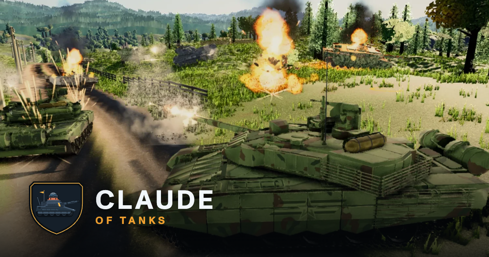
  </a>
</p>

<h1 align="center">CLAUDE OF TANKS</h1>

<p align="center">
  Free browser-native armored combat built with <strong>Three.js</strong>. Take 127 production-visible first-party procedural vehicles
  across 20 battlefields with physical gunnery, plate-level armor, internal damage, guided missiles,
  magazine autoloaders, terrain-following suspension, X-ray killcams, multiplayer rooms, and Scene Studio.
</p>

<table width="100%" align="center">
<tr>
<td width="20%" align="center" valign="middle" bgcolor="#05080b"><a href="https://cot.kevinliu.studio/"><br><strong>PLAY</strong></a></td>
<td width="20%" align="center" valign="middle" bgcolor="#05080b"><a href="https://cot.kevinliu.studio/docs"><br><strong>FIELD MANUAL</strong></a></td>
<td width="20%" align="center" valign="middle" bgcolor="#05080b"><a href="https://cot.kevinliu.studio/gallery"><br><strong>TANK GALLERY</strong></a></td>
<td width="20%" align="center" valign="middle" bgcolor="#05080b"><a href="https://cot.kevinliu.studio/studio"><br><strong>SCENE STUDIO</strong></a></td>
<td width="20%" align="center" valign="middle" bgcolor="#05080b"><a href="docs/INDEX.md"><br><strong>ENGINEERING DOCS</strong></a></td>
</tr>
</table>

<table>
<tr>
<td width="50%">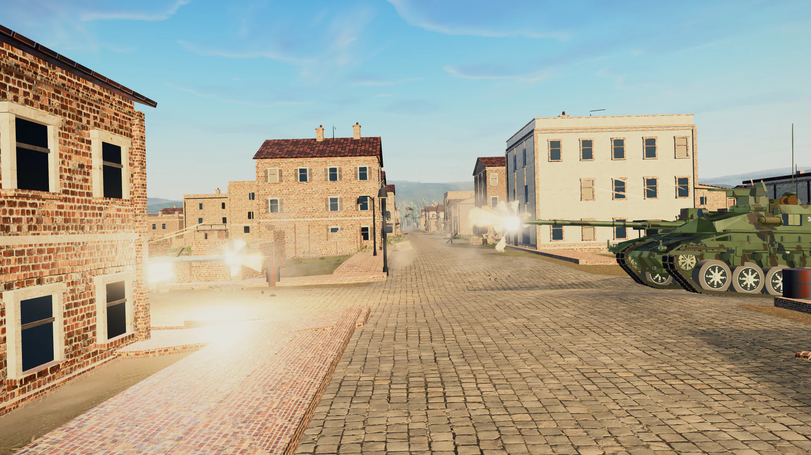</td>
<td width="50%">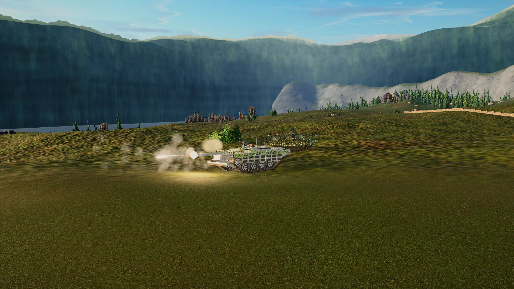</td>
</tr>
<tr>
<td width="50%">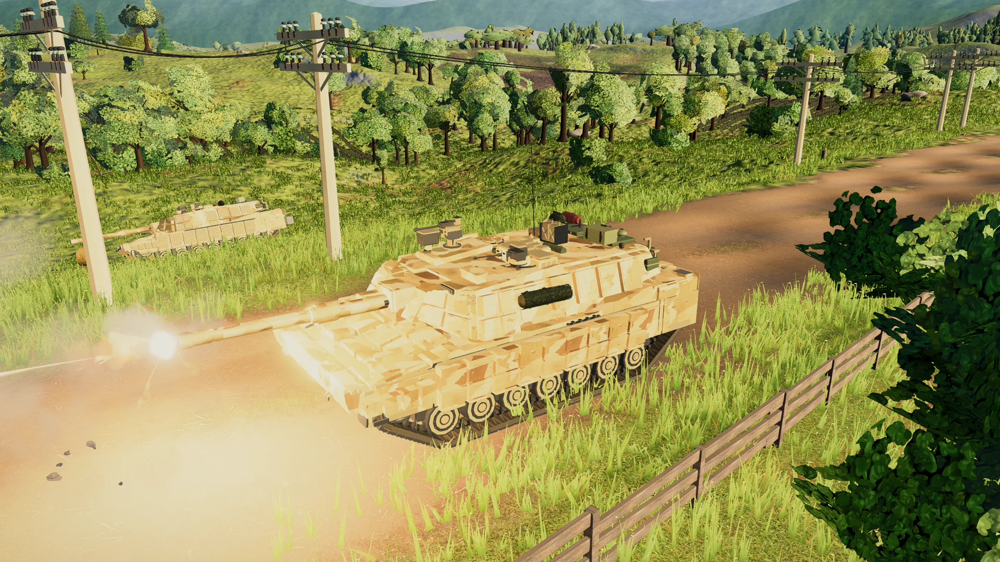</td>
<td width="50%">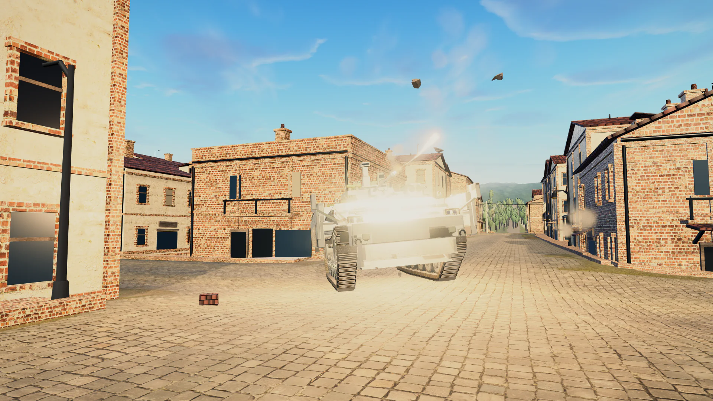</td>
</tr>
</table>

These are deterministic scenes captured with the current game renderer—not concept art. The
[40-frame R2 showcase archive](public/media/showcase-r2/manifest.json) contains ten Garage environments, six interface
surfaces, nine live feature states, three vehicle detail views, and twelve battlefield action frames. Its page map
covers the landing page, Garage, Tank Gallery, Scene Studio, docs overview, and every focused manual.

## Fight, inspect, and direct

<p>
  
  
  
</p>

- **Fight:** enter Standard Battle, Capture the Flag, Zone Control, armed super-speed Turbo Ball, or cooperative
  Endless Horde in solo or multiplayer, with physical shell travel, armor geometry, component damage, spotting,
  terrain, collision, destructible structures, persistent wrecks, mode-specific respawns, and authority-owned results.
- **Inspect:** open any vehicle in Tank Gallery, articulate the live rig, isolate armor or internal anatomy, and export an
  exact-surface review packet from the same specification used in combat.
- **Direct:** stage any roster vehicle on any battlefield in Scene Studio, animate actors and cameras, schedule game FX,
  and capture stills or video from reproducible scene data.

## Current release

| | Current runtime |
| --- | --- |
| Fleet | **127** production-visible and **164** keyed local-development procedural vehicles across **166** saved roster records; **0** GLB-sourced playables |
| Worlds | **20** authored battlefields with shared structures, wrecks, utility networks, loose props, placement, collision, and destruction |
| Authority | Fixed **60 Hz** movement, ballistics, armor, damage, spotting, bots, destructibles, and result |
| Presentation | Direct Three.js/WebGL renderer with a measured **120 FPS** test path, adaptive quality, stable shadows, SMAA/FSR, and GPU recovery |
| Play | Five battle rules, solo bots, persistent private rooms, LAN rooms, room chat, spectators, respawns, rematches, and dedicated ranked authority |
| Platforms | Mouse/keyboard and complete touch controls with safe-area layout and device-adaptive rendering |
| Tools | Scene Studio, Tank Gallery, exact-surface review, deterministic capture, vehicle anatomy, and release gates |

The provenance gate currently reports **137 first-party procedural battle playables, 0 GLB-sourced playables, and 7
tracked external comparison models with exact source records**. Comparison inputs are never a playable loading path and are stripped from public builds.

## Field footage

<p>
  
  
</p>

Each frame below opens a looping WebM recorded from the game. The camera rails use live vehicles, maps, ballistics,
recoil, impacts, sparks, smoke, debris, and destruction effects.

<table>
<tr>
<td width="50%"><a href="public/media/hero-rails-r2/01_desert-ground-rush.webm">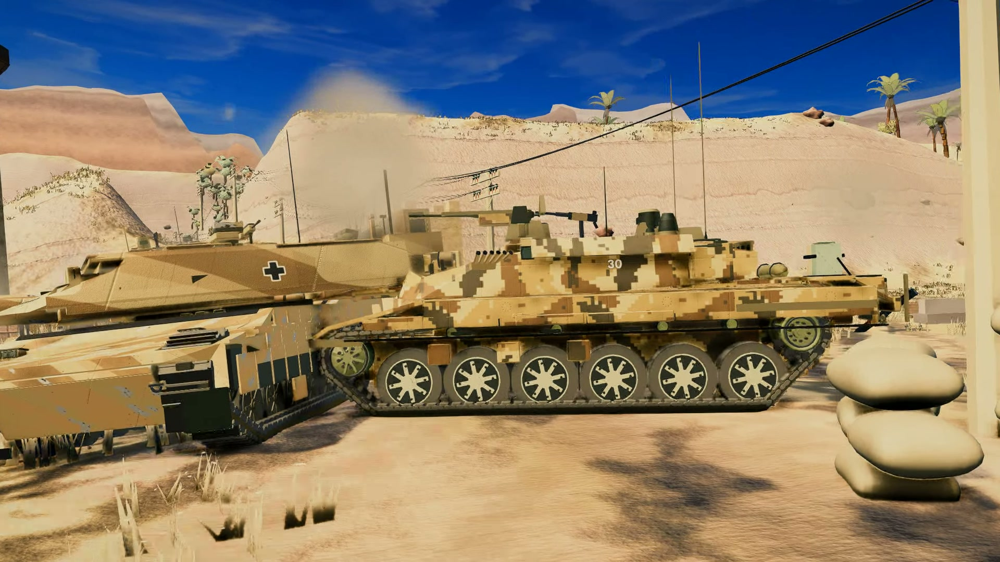</a><br><sub><b>Desert Ground Rush:</b> a low camera threads moving armor and incoming fire.</sub></td>
<td width="50%"><a href="public/media/hero-rails-r2/04_urban-overhead-dive.webm">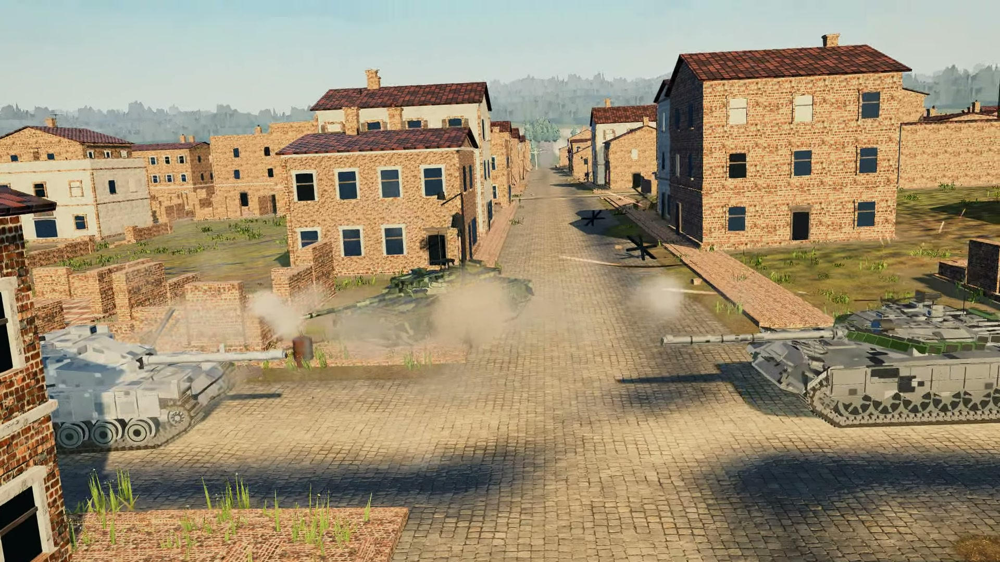</a><br><sub><b>Urban Overhead Dive:</b> a rail camera drops into a close street engagement.</sub></td>
</tr>
<tr>
<td width="50%"><a href="public/media/hero-rails-r2/02_winter-ice-orbit.webm">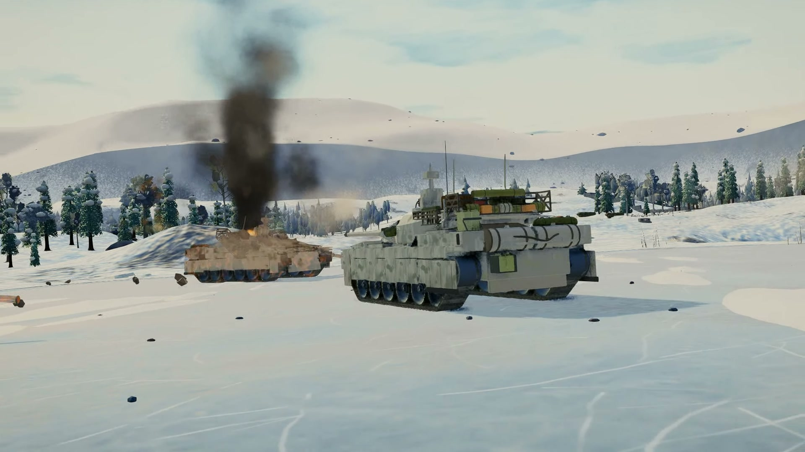</a><br><sub><b>Winter Ice Orbit:</b> tanks exchange fire while the camera circles the frozen contact line.</sub></td>
<td width="50%"><a href="public/media/hero-rails-r2/05_coastal-shell-skim.webm">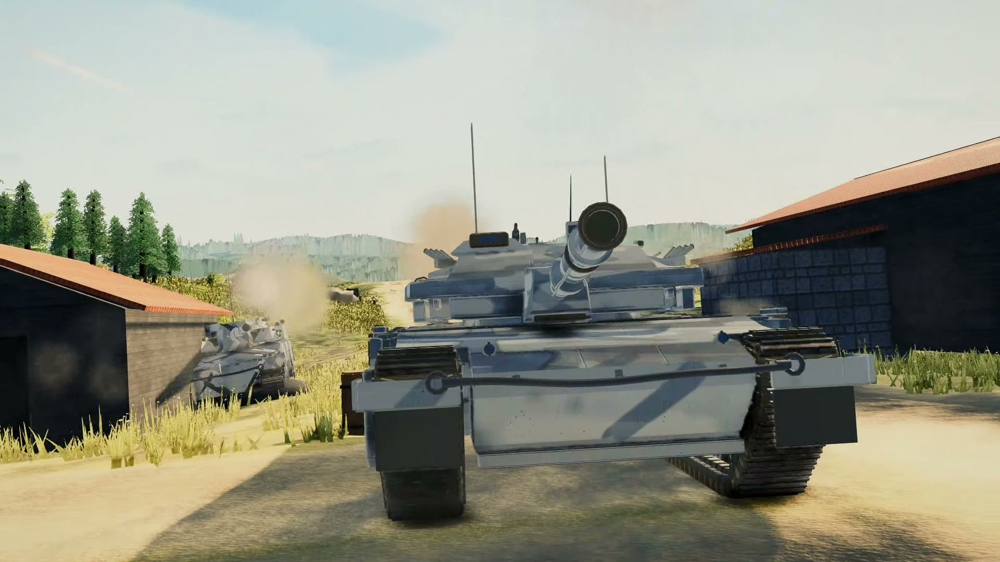</a><br><sub><b>Coastal Shell Skim:</b> a fast lateral pass follows the shell path through a beach assault.</sub></td>
</tr>
</table>

<p align="center">
  <a href="https://cot.kevinliu.studio/home"><strong>OPEN THE FULL LANDING SHOWCASE</strong></a>
</p>

## Vehicle-specific mechanics

<p>
  
  
  
</p>

The fleet does not reduce every vehicle to the same gun and movement model. Specifications can add their own loading,
guidance, suspension, ammunition, anatomy, and control behavior while remaining inside the fixed-step authority.

<table>
<tr>
<td width="50%">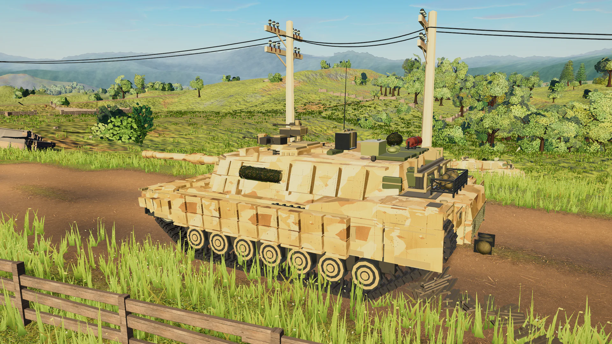<br><sub><b>Running-gear destruction:</b> track hits can detach the loaded procedural track path while preserving the resolved suspension and wheel geometry.</sub></td>
<td width="50%">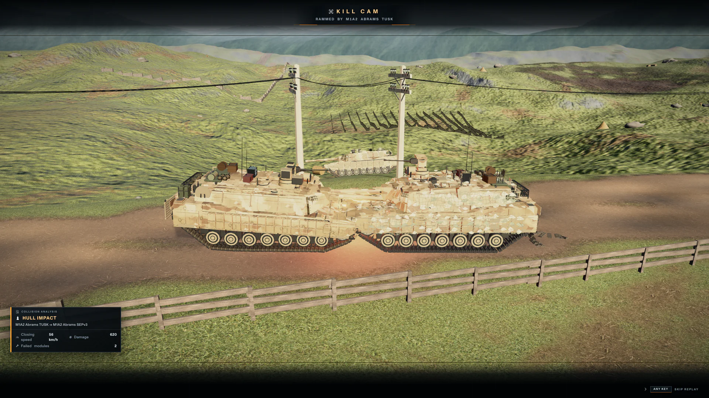<br><sub><b>Resolved impacts:</b> the killcam presents the authoritative armor contact, shell path, effects, and damage result without simulating a second outcome.</sub></td>
</tr>
<tr>
<td width="50%">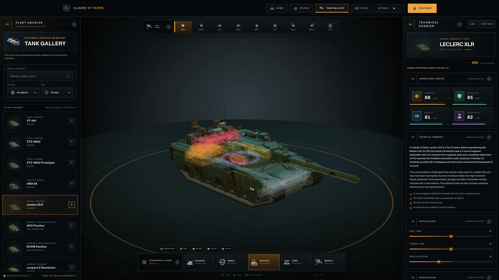<br><sub><b>Internal anatomy:</b> the Gallery shows crew, gun, turret ring, engine, fuel, ammunition, tracks, optics, radio, and vehicle-specific feed or missile systems.</sub></td>
<td width="50%">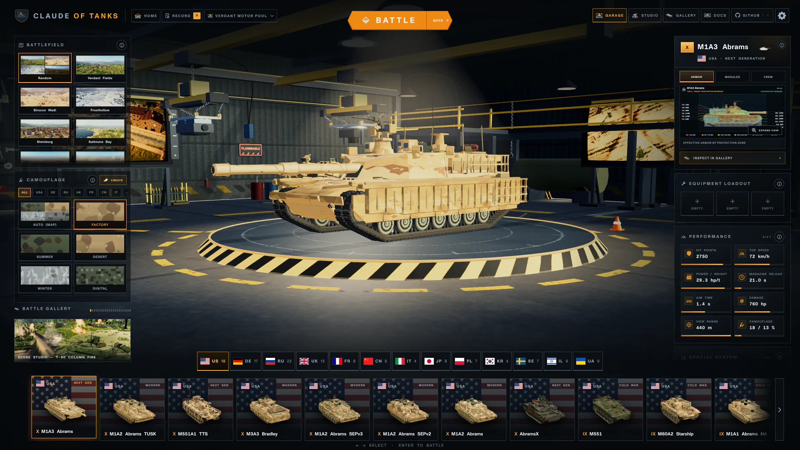<br><sub><b>One shared fleet:</b> battle, Garage, Gallery, Studio, bots, icons, diagrams, and technical dossiers read the same vehicle specifications—127 in production or 164 in keyed local development.</sub></td>
</tr>
</table>

- **Magazine autoloaders** track ready rounds, intra-magazine cycle time, full replenishment, manual magazine reloads,
  shell changes, and damage to the loading mechanism. The Leclerc, Type 90, PL-01, and four-round PL-01 105 each carry
  their own magazine timings.
- **Guided missiles** travel at visible weapon-specific speeds and steer toward the authority-owned aim point. Launcher
  damage, rack damage, ammunition count, reload state, guidance, impact, and presentation all remain synchronized.
- **Hydropneumatic aim** uses the same canonical pose for armor, muzzle, collision, wheels, tracks, remote snapshots, and
  the camera; there is no separate visual-only tank tilt.
- **Free look** keeps the sight and turret on target while the camera moves. Hold `Shift` on keyboard, `RB` on a standard
  controller, or assign another binding in settings.

## Combat systems

<p>
  
  
  
</p>

<table>
<tr>
<td width="50%">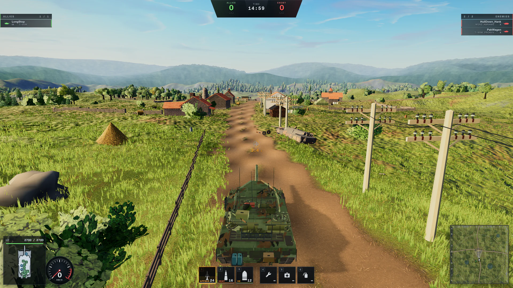<br><sub><b>Battle HUD:</b> dual reticle, ammunition, modules, teams, minimap, chat, performance, and authority-owned combat feedback.</sub></td>
<td width="50%">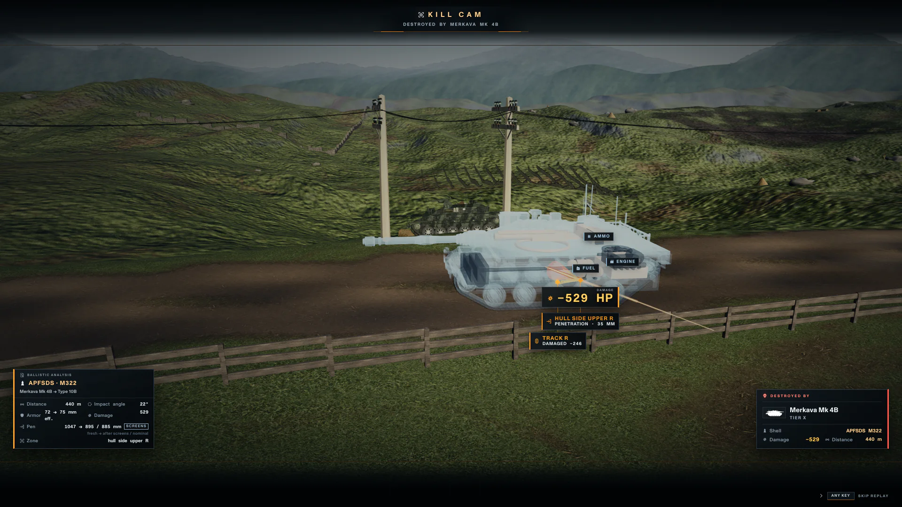<br><sub><b>X-ray killcam:</b> the resolved shell path, struck plate, effective protection, penetration result, damaged modules, and crew.</sub></td>
</tr>
<tr>
<td width="50%"><br><sub><b>Physical gunnery:</b> finite world aim, bore convergence, resolved muzzle transform, visible recoil, dispersion, travel time, and gravity.</sub></td>
<td width="50%">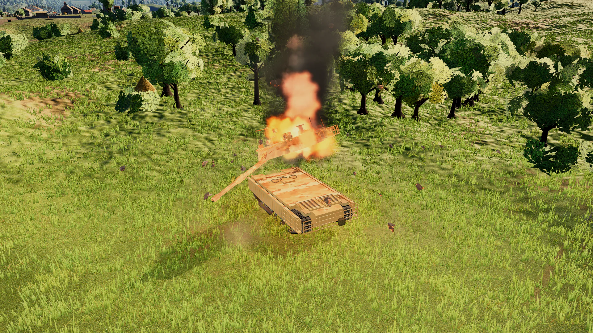<br><sub><b>Destruction:</b> fire, sparks, smoke, detached remnants, persistent wreck state, and pooled effects driven by the completed hit.</sub></td>
</tr>
</table>

- **Plate-level armor** resolves the actual plate, slope, impact angle, normalization, ricochet, overmatch, spaced armor,
  composites, ERA, and separate kinetic/chemical protection.
- **Five ammunition families** model muzzle velocity, gravity, penetration loss, ricochet, and damage differently.
- **Internal anatomy** tracks crew, ammunition racks, engine, fuel, gun, turret ring, optics, radio, and tracks.
- **Tank-specific mobility** combines drivetrain, terrain resistance, per-wheel support, suspension-damped hull attitude,
  flexible terrain-following tracks, collision, ramming, and crushable cover.
- **Real battlefield knowledge** combines view range, concealment, movement/firing bloom, foliage, radio sharing, and the
  15 m bush rule. Multiplayer authority filters hidden enemies before serializing a snapshot.

## Worlds and vehicle design

<p>
  
  
  
</p>

<table>
<tr>
<td width="50%">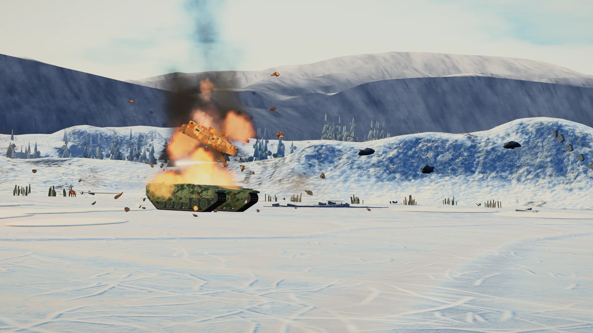<br><sub><b>Twenty worlds:</b> terrain, roads, structures, foliage, fog, sky, lighting, cover, collision, minimap, and dedicated-server descriptors.</sub></td>
<td width="50%">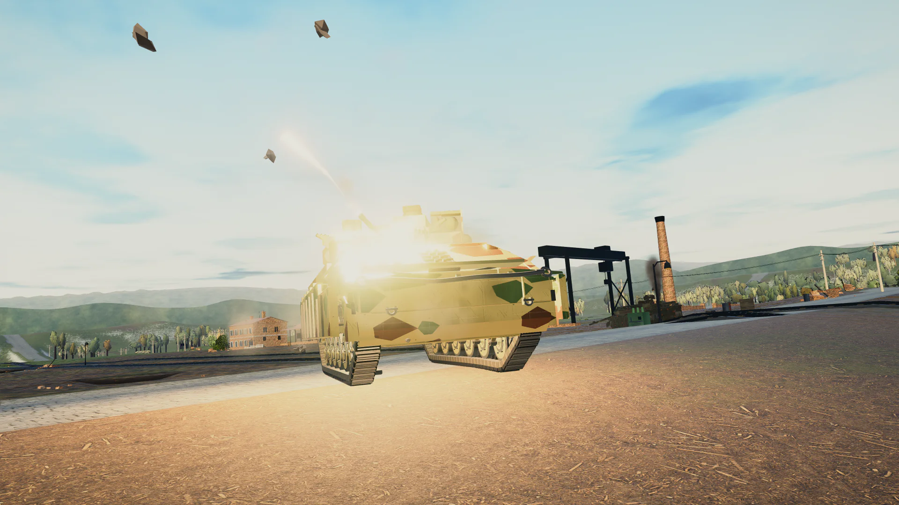<br><sub><b>Shared world kit:</b> destructible buildings, camps, wreck families, debris, utility lines, loose physical props, and narrow hitboxes.</sub></td>
</tr>
<tr>
<td width="50%">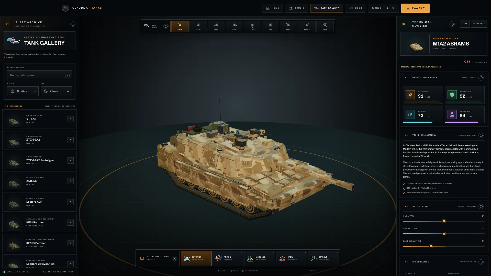<br><sub><b>Tank Gallery:</b> search 127 production vehicles or 164 with the local development fleet enabled, orbit and articulate the current vehicle rig, inspect armor, modules, and crew, and export exact-surface review packets.</sub></td>
<td width="50%">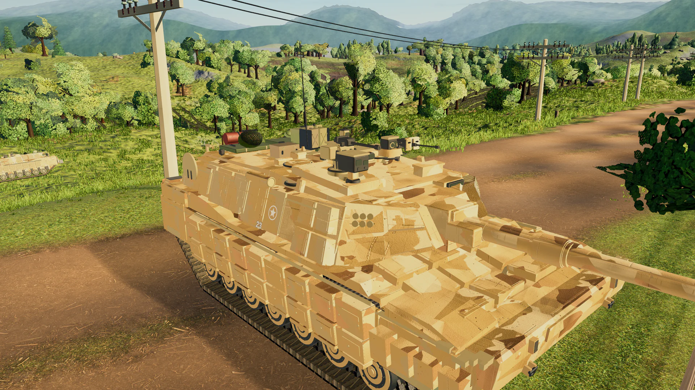<br><sub><b>Shared vehicle specification:</b> geometry, armor, modules, gun limits, ammunition, mobility, garage cards, bots, icons, diagrams, Gallery, and Studio.</sub></td>
</tr>
</table>

Every playable hull, turret, gun, fitting, suspension, road wheel, and track run is assembled by the repository's
first-party vehicle pipeline. Vehicle changes pass combat-anatomy receipts, generated technical diagrams, geometry
checks, visual fingerprints, and a targeted release gate.

### Ten Garage environments

<p align="center">
  <a href="public/media/showcase-r2/process/review-01.webp"></a>
</p>

The Garage is its own authored presentation system. Verdant retains the enclosed Motor Pool; the other nine locations
use lightweight scene packs derived from a real battlefield's terrain, structures, PBR materials, detailed trees,
approach route, horizon, sky, and atmosphere without loading that battlefield. One immutable hero pose keeps the tank
and camera comparable across the complete set, while connected maintenance stations, heavy-lift equipment, real fleet
exhibits, and full-detail tank parts establish a distinct service story around every platform.

The release gate reviews every location from four orbit angles and responsive layouts, rejects unsupported or floating
parts, certifies geometry-derived structure collision, and requires a score of at least 90/100 with bounded draw calls,
triangles, transitions, cache residency, and repeated-cycle memory. See the
[Garage environments guide](docs/GARAGE-ENVIRONMENTS.md) for the complete visual, lifecycle, and verification contract.

## Renderer, drivers, and performance

<p>
  
</p>

The renderer treats quality as a device contract instead of a single desktop preset. It selects a GPU/driver-aware
profile, caps pixel density, prewarms shader paths, adapts costly effects, and can recover from a black frame or WebGL
context loss. The current presentation path combines:

- four quality-scaled, stable texel-anchored shadow cascades with articulation-aware tank shadow hulls;
- fused output grading, anti-aliasing, adaptive render scale, fog/atmosphere, and bounded transparent depth work;
- instance/batch paths for repeated world objects, pooled particles, and explicit GPU resource disposal;
- reusable hot-loop scratch state, fixed-step simulation, render interpolation, and high-refresh presentation;
- an in-game diagnostics surface for FPS, ping, frame timing, draw calls, triangles, memory, network telemetry, quality,
  and renderer/driver identity.

The renderer reached **120 FPS on the certified test hardware**. Actual performance depends on refresh rate, browser,
thermal limits, GPU and driver, resolution, and quality level. Combat rules remain fixed at 60 Hz at every render rate.

<table>
<tr>
<td width="50%">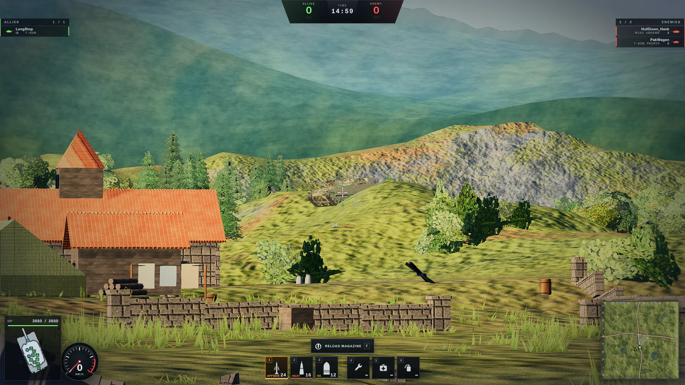<br><sub><b>Presentation:</b> high-resolution scope, stable shadowing, post AA, bounded depth copies, and readable combat overlays.</sub></td>
<td width="50%">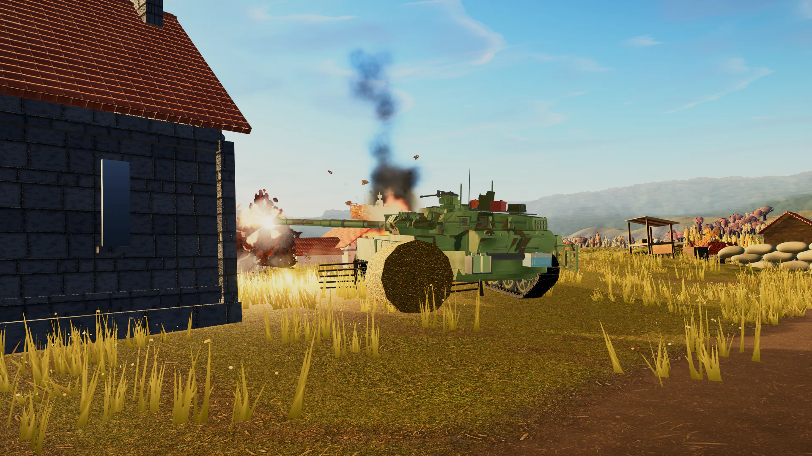<br><sub><b>World rendering:</b> authored layouts and detailed environments use adaptive quality, instancing, culling, and streaming.</sub></td>
</tr>
</table>

## Multiplayer

<p>
  
</p>

Local, LAN, browser-hosted private, and dedicated ranked modes share the same renderer-free movement and combat rules.
Clients send intent, never trusted hits or damage. Snapshot filtering, local prediction/reconciliation, bounded remote
interpolation, reliable fire edges, reconnectable room state, and separate control/chat delivery keep a moving and firing
7v7 battle responsive without giving the client authority.

<p align="center">
  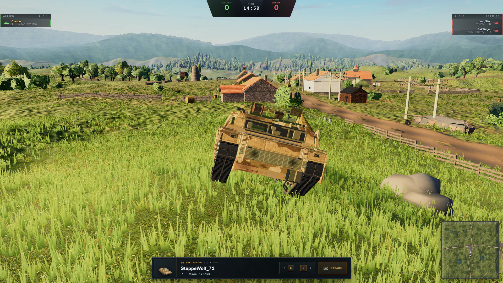
</p>
<p align="center"><sub><b>Two screens, opposing sights:</b> paired live 1v1 captures preserve the real battle HUD, authoritative simulation, filtered snapshots, and each commander's view.</sub></p>

### Controls at a glance

| Action | Keyboard and mouse | Standard controller |
| --- | --- | --- |
| Drive and steer | `WASD` or arrow keys | Left stick |
| Aim and fire | Mouse + `LMB` | Right stick + `RT` |
| Precision sight | Hold `RMB` by default; wheel in also enters | `LT` |
| Free look without moving the turret | Hold `Shift` or `Left Alt` | `RB` |
| Select ammunition | `1` / `2` / `3` | D-pad |
| Vehicle-specific action | `E` | `LB` |
| Reload a partial magazine | `C` | Remappable |
| Consumables | `4` / `5` / `6` | Remappable |
| Handbrake | `Space` | `A` |
| Shot log / performance / menu | `L` / `F8` / `Esc` | Interface controls |

Every desktop action is remappable. `RMB` can use hold-to-aim, toggle-aim, or classic free-look behavior. Touch devices
receive dedicated movement, aim, scope, fire, ammunition, equipment, and special-action controls rather than a scaled
desktop HUD.

## Production tools

<p>
  
  
  
</p>

<table>
<tr>
<td width="50%">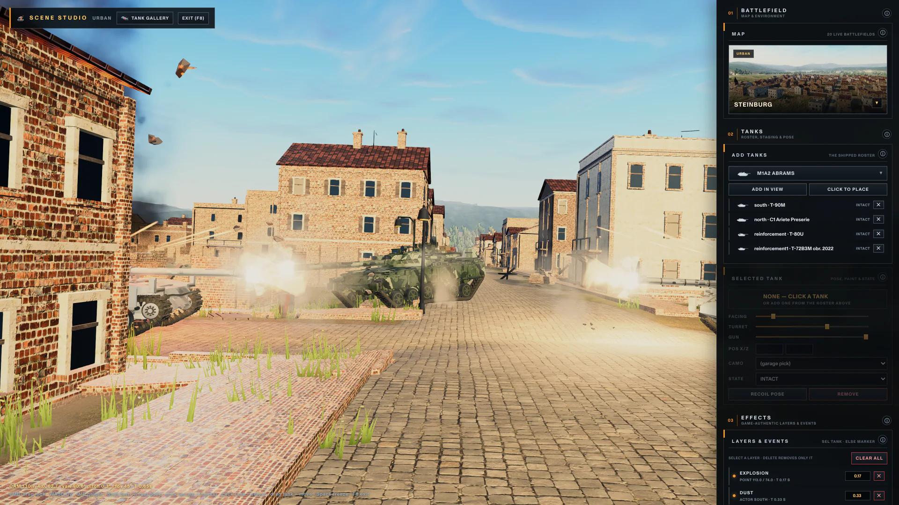<br><sub><b>Scene Studio:</b> place any roster vehicle on any map, conform it to terrain, set its pose within physical limits, schedule game effects on a deterministic timeline, and capture the current renderer.</sub></td>
<td width="50%"><a href="public/media/landing-r1/studio-leclerc-knockout.webm">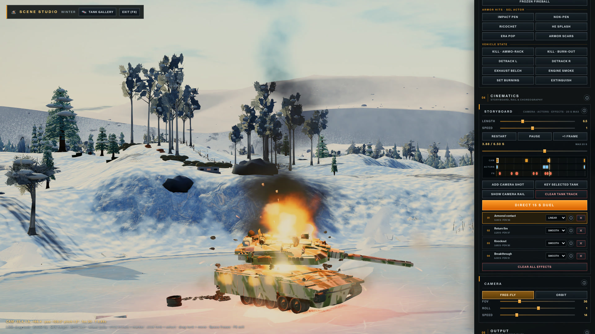</a><br><sub><b>Directed destruction:</b> this 1080p timeline moves both actors, fires the Strv 122, resolves impacts, detaches the Leclerc track, and triggers its ammunition-rack blast.</sub></td>
</tr>
</table>

Scene Studio works with the runtime rather than a separate cinematic renderer. Vehicles, camouflage, camera, lighting,
recoil, tracers, explosions, sparks, smoke, debris, wreck state, and timeline events remain scene data. A saved scene can
be replayed, scrubbed, edited, exported as JSON, captured as a high-resolution still, or recorded as a video.

Regenerate the current public archive:

```bash
npm run shots:r2:capture
npm run shots:r2:grade
npm run shots:r2:publish
npm run shots:r2:check
```

The capture harness serializes concurrent jobs, starts a clean local game, verifies the requested state, and records
current rendering diagnostics. `public/media/showcase-r2/manifest.json` defines the 40-frame source archive, public
page assignments, feature and map labels, dimensions, and quality receipts.

The same run is reviewed in contact sheets before any frame becomes a 4K master. These collection views make weak
silhouettes, obstructed cameras, repeated compositions, and overpowered effects obvious before automated grading.

<table>
<tr>
<td width="50%"><a href="public/media/showcase-r2/process/review-01.webp"></a><br><sub><b>Garage review:</b> all ten production locations inspected together.</sub></td>
<td width="50%"><a href="public/media/showcase-r2/process/review-04.webp"></a><br><sub><b>Battlefield review:</b> close action checked against vehicle readability and map identity.</sub></td>
</tr>
</table>

[Open all four review sheets](docs/SHOWCASE-LIBRARY.md#review-sheets) and the complete admission contract.

## Selected field frames

The landing page publishes a larger responsive mosaic. This smaller wall samples current Garage, interface, feature,
vehicle, and battlefield captures.

<table>
<tr>
<td width="25%"></td>
<td width="25%"></td>
<td width="25%"></td>
<td width="25%">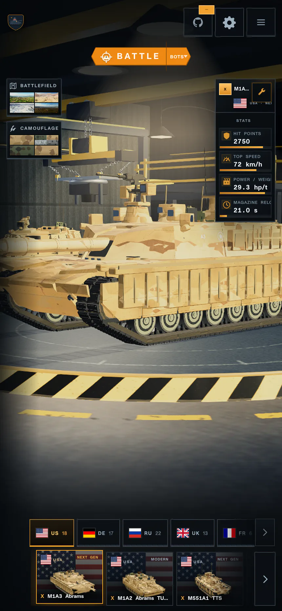</td>
</tr>
<tr>
<td width="25%"></td>
<td width="25%"></td>
<td width="25%"></td>
<td width="25%"></td>
</tr>
<tr>
<td width="25%">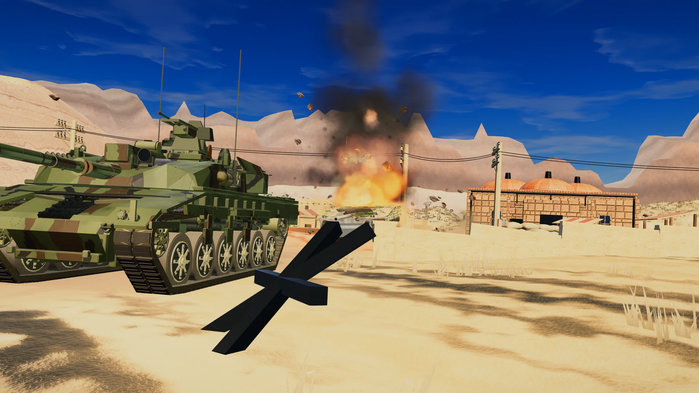</td>
<td width="25%"></td>
<td width="25%">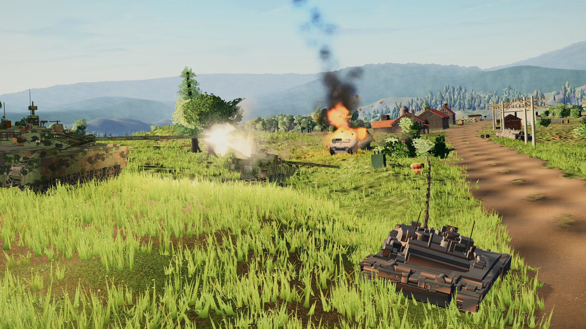</td>
<td width="25%"></td>
</tr>
</table>

[Browse the full showcase manifest](public/media/showcase-r2/manifest.json),
[open the public Tank Gallery](https://cot.kevinliu.studio/gallery), or
[build a new shot in Scene Studio](https://cot.kevinliu.studio/studio).

## Architecture

```text
controls ──► deterministic authority ──► filtered state + reliable events ──► presentation
                 │                                                           │
                 ├─ movement / terrain / collision                            ├─ procedural vehicles
                 ├─ aim / ballistics / armor / anatomy                        ├─ tracks / suspension / FX
                 ├─ spotting / concealment / bots                             ├─ HUD / audio / killcam
                 └─ destructibles / match result                              └─ Three.js / post / Studio
```

```text
src/engine/    renderer, camera, lighting, post, quality, telemetry, GPU recovery
src/world/     twenty maps, terrain, vegetation, props, collision, destruction
src/vehicles/  specs, procedural geometry, materials, profiles, asset verification
src/sim/       DOM-free movement, aiming, ballistics, armor, damage, spotting
src/game/      local composition, bots, input, profile, killcam, Scene Studio
src/net/       protocol, rooms, chat, snapshots, prediction, WebRTC/WebSocket
src/ui/        garage, battle HUD, reports, settings, diagnostics, touch controls
server/        signaling, persistent rooms, dedicated authority, ranked service
```

Start with [Technical overview](docs/TECHNICAL-OVERVIEW.md), [Product features](docs/FEATURES.md),
[How it works](docs/HOW-IT-WORKS.md), [Multiplayer architecture](docs/MULTIPLAYER-ARCHITECTURE.md),
[Performance](docs/PERFORMANCE.md), [Scene Studio](docs/STUDIO.md), and [Tank Gallery](docs/GALLERY.md).

## Develop and verify

```bash
npm install
npx vite
npm test
npm run test:net:browser
npm run tank:native:check
npm run build
npm run build:private
```

The public build strips quarantined comparison assets. Simulation, networking, browser multiplayer, maps, collision,
destruction, rendering policy, UI, mobile controls, vehicle provenance, anatomy, generated assets, and both build variants
have executable checks.

## Credits and licensing

**Kevin B. Liu** created, designed, and directed the project. Claude and Codex assisted with research, vehicle authoring,
simulation, networking, design, performance, quality assurance, documentation, and deployment. They are development
tools, not co-authors or copyright holders.

All gameplay code and every selectable procedural vehicle model are original first-party work by Kevin B. Liu. The
repository is MIT-licensed by default, with procedural vehicle and battlefield source, fleet and map data, generated game
assets, capture recipes, authored media, and first-party branding expressly excluded as proprietary Reserved Content.
Earlier public revisions remain available under the MIT terms under which they were released. See [`LICENSE`](LICENSE), [`LICENSE-POLICY.md`](LICENSE-POLICY.md),
[`NOTICE.md`](NOTICE.md), and [`docs/ATTRIBUTION.md`](docs/ATTRIBUTION.md) before reusing any file. External models may be
retained only as quarantined research references; they are never loaded as playable geometry.
