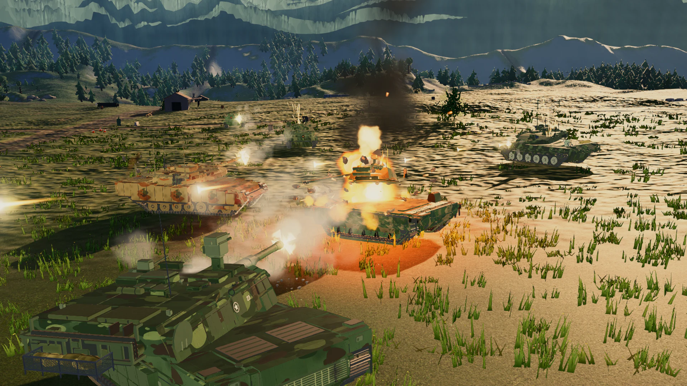
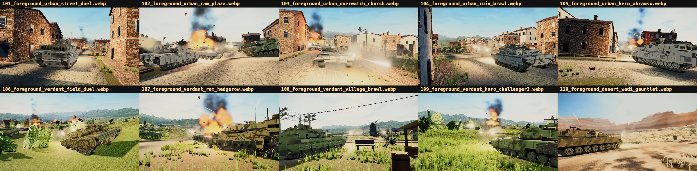

<p align="center">
  <a href="https://cot.kevinliu.studio">
    
  </a>
</p>

<h1 align="center">CLAUDE OF TANKS</h1>

<p align="center">
  Browser-based armored combat built with <strong>Three.js</strong>: 112 production-visible first-party procedural vehicles,
  16 destructible battlefields, plate-level armor, physical gunnery, X-ray killcams,
  multiplayer rooms, Scene Studio production tools, and adaptive desktop and mobile rendering.
</p>

<p align="center">
  <a href="https://cot.kevinliu.studio"><strong>PLAY</strong></a>
  &nbsp;·&nbsp;
  <a href="https://cot.kevinliu.studio/docs">FIELD MANUAL</a>
  &nbsp;·&nbsp;
  <a href="https://cot.kevinliu.studio/gallery">TANK GALLERY</a>
  &nbsp;·&nbsp;
  <a href="docs/INDEX.md">ENGINEERING DOCS</a>
</p>

<table>
<tr>
<td width="33%"></td>
<td width="33%"></td>
<td width="34%"></td>
</tr>
</table>

Every image above is a handmade, deterministic composition captured with the current game renderer. The
[88-frame showcase library](public/media/showcase-r1/manifest.json) begins with 13 owner-selected scenes, followed by
60 approved action and foreground frames, five directed Studio frames, and ten interface states.

## Current release

| | Current runtime |
| --- | --- |
| Fleet | **112** production-visible and **148** keyed local-development procedural vehicles across **150** saved roster records; **0** GLB-sourced playables |
| Worlds | **16** authored battlefields with shared structures, wrecks, utility networks, loose props, placement, collision, and destruction |
| Authority | Fixed **60 Hz** movement, ballistics, armor, damage, spotting, bots, destructibles, and result |
| Presentation | Direct Three.js/WebGL renderer with a measured **120 FPS** test path, adaptive quality, stable shadows, SMAA/FSR, and GPU recovery |
| Play | Solo bots, persistent private rooms, LAN rooms, room chat, spectators, rematches, and dedicated ranked authority |
| Platforms | Mouse/keyboard and complete touch controls with safe-area layout and device-adaptive rendering |
| Tools | Scene Studio, Tank Gallery, exact-surface review, deterministic capture, vehicle anatomy, and release gates |

The provenance gate currently reports **121 first-party procedural battle playables, 0 GLB-sourced playables, and 7
isolated comparison candidates**. Comparison inputs are never a playable loading path and are stripped from public builds.

## Combat systems

<table>
<tr>
<td width="50%"><br><sub><b>Battle HUD:</b> dual reticle, ammunition, modules, teams, minimap, chat, performance, and authority-owned combat feedback.</sub></td>
<td width="50%"><br><sub><b>X-ray killcam:</b> the resolved shell path, struck plate, effective protection, penetration result, damaged modules, and crew.</sub></td>
</tr>
<tr>
<td width="50%"><br><sub><b>Physical gunnery:</b> finite world aim, bore convergence, resolved muzzle transform, visible recoil, dispersion, travel time, and gravity.</sub></td>
<td width="50%"><br><sub><b>Destruction:</b> fire, sparks, smoke, detached remnants, persistent wreck state, and pooled effects driven by the completed hit.</sub></td>
</tr>
</table>

- **Plate-level armor** resolves the actual plate, slope, impact angle, normalization, ricochet, overmatch, spaced armor,
  composites, ERA, and separate kinetic/chemical protection.
- **Five ammunition families** model muzzle velocity, gravity, penetration loss, ricochet, and damage differently.
- **Internal anatomy** tracks crew, ammunition racks, engine, fuel, gun, turret ring, optics, radio, and tracks.
- **Tank-specific mobility** combines drivetrain, terrain resistance, per-wheel support, suspension-damped hull attitude,
  flexible terrain-following tracks, collision, ramming, and crushable cover.
- **Real battlefield knowledge** combines view range, concealment, movement/firing bloom, foliage, radio sharing, and the
  15 m bush rule. Multiplayer authority filters hidden enemies before serializing a snapshot.

## Worlds and vehicle design

<table>
<tr>
<td width="50%"><br><sub><b>Sixteen worlds:</b> terrain, roads, structures, foliage, fog, sky, lighting, cover, collision, minimap, and dedicated-server descriptors.</sub></td>
<td width="50%"><br><sub><b>Shared world kit:</b> destructible buildings, camps, wreck families, debris, utility lines, loose physical props, and narrow hitboxes.</sub></td>
</tr>
<tr>
<td width="50%"><br><sub><b>Tank Gallery:</b> search 112 production vehicles or 148 with the local development fleet enabled, orbit and articulate the current vehicle rig, inspect armor, modules, and crew, and export exact-surface review packets.</sub></td>
<td width="50%"><br><sub><b>Shared vehicle specification:</b> geometry, armor, modules, gun limits, ammunition, mobility, garage cards, bots, icons, diagrams, Gallery, and Studio.</sub></td>
</tr>
</table>

Every playable hull, turret, gun, fitting, suspension, road wheel, and track run is assembled by the repository's
first-party vehicle pipeline. Vehicle changes pass combat-anatomy receipts, generated technical diagrams, geometry
checks, visual fingerprints, and a targeted release gate.

## Renderer, drivers, and performance

The renderer treats quality as a device contract instead of a single desktop preset. It selects a GPU/driver-aware
profile, caps pixel density, prewarms shader paths, adapts costly effects, and can recover from a black frame or WebGL
context loss. The current presentation path combines:

- four quality-scaled, stable texel-anchored shadow cascades with articulation-aware tank shadow hulls;
- fused output grading, anti-aliasing, adaptive render scale, fog/atmosphere, and bounded transparent depth work;
- instance/batch paths for repeated world objects, pooled particles, and explicit GPU resource disposal;
- reusable hot-loop scratch state, fixed-step simulation, render interpolation, and high-refresh presentation;
- an in-game diagnostics surface for FPS, ping, frame timing, draw calls, triangles, memory, network telemetry, quality,
  and renderer/driver identity.

The renderer reached **120 FPS on the certified test hardware**. Actual performance depends on refresh rate, browser,
thermal limits, GPU and driver, resolution, and quality level. Combat rules remain fixed at 60 Hz at every render rate.

<table>
<tr>
<td width="50%"><br><sub><b>Presentation:</b> high-resolution scope, stable shadowing, post AA, bounded depth copies, and readable combat overlays.</sub></td>
<td width="50%"><br><sub><b>World rendering:</b> authored layouts and detailed environments use adaptive quality, instancing, culling, and streaming.</sub></td>
</tr>
</table>

## Multiplayer and mobile

Local, LAN, browser-hosted private, and dedicated ranked modes share the same renderer-free movement and combat rules.
Clients send intent, never trusted hits or damage. Snapshot filtering, local prediction/reconciliation, bounded remote
interpolation, reliable fire edges, reconnectable room state, and separate control/chat delivery keep a moving and firing
7v7 battle responsive without giving the client authority.

<table>
<tr>
<td width="62%"><br><sub><b>Desktop:</b> nation rail, vehicle deck, map and camouflage previews, dossiers, equipment, local profile, settings, and multiplayer rooms.</sub></td>
<td width="38%"><br><sub><b>Mobile:</b> safe-area layout, touch-sized command surfaces, joystick/swipe aim, pinch-to-scope, dynamic fire, and adaptive graphics.</sub></td>
</tr>
</table>

## Production tools

<table>
<tr>
<td width="50%"><br><sub><b>Scene Studio:</b> place any roster vehicle on any map, conform it to terrain, set its pose within physical limits, schedule game effects on a deterministic timeline, and capture the current renderer.</sub></td>
<td width="50%"><br><sub><b>Reproducible imagery:</b> vehicles, camos, camera, lighting, recoil, tracers, explosions, sparks, smoke, debris, wrecks, and timeline are scene data—not composited concept art.</sub></td>
</tr>
</table>

Regenerate the current public archive:

```bash
npm run shots:battle:generate
npm run shots:battle:grade -- --root shots/marketing-battles-r3
npm run studio:action:render
npm run showcase:publish
npm run showcase:check
```

The capture harness serializes concurrent jobs, starts a clean local game, verifies the requested state, and records
current rendering diagnostics. `public/media/showcase-r1/manifest.json` defines the published archive.

The same run is reviewed in contact sheets before any frame becomes a 4K master. These collection views make weak
silhouettes, obstructed cameras, repeated compositions, and overpowered effects obvious before automated grading.

<table>
<tr>
<td width="50%"><a href="public/media/showcase-r1/process/action-review-02.webp"></a><br><sub><b>Action review:</b> ten multi-tank compositions inspected together.</sub></td>
<td width="50%"><a href="public/media/showcase-r1/process/foreground-review-02.webp"></a><br><sub><b>Foreground review:</b> anchor-tank readability checked against battle depth.</sub></td>
</tr>
</table>

[Open all six review sheets](docs/SHOWCASE-LIBRARY.md#review-sheets) and the complete admission contract.

## Architecture

```text
controls ──► deterministic authority ──► filtered state + reliable events ──► presentation
                 │                                                           │
                 ├─ movement / terrain / collision                            ├─ procedural vehicles
                 ├─ aim / ballistics / armor / anatomy                        ├─ tracks / suspension / FX
                 ├─ spotting / concealment / bots                             ├─ HUD / audio / killcam
                 └─ destructibles / match result                              └─ Three.js / post / Studio
```

```text
src/engine/    renderer, camera, lighting, post, quality, telemetry, GPU recovery
src/world/     sixteen maps, terrain, vegetation, props, collision, destruction
src/vehicles/  specs, procedural geometry, materials, profiles, asset verification
src/sim/       DOM-free movement, aiming, ballistics, armor, damage, spotting
src/game/      local composition, bots, input, profile, killcam, Scene Studio
src/net/       protocol, rooms, chat, snapshots, prediction, WebRTC/WebSocket
src/ui/        garage, battle HUD, reports, settings, diagnostics, touch controls
server/        signaling, persistent rooms, dedicated authority, ranked service
```

Start with [Technical overview](docs/TECHNICAL-OVERVIEW.md), [Product features](docs/FEATURES.md),
[How it works](docs/HOW-IT-WORKS.md), [Multiplayer architecture](docs/MULTIPLAYER-ARCHITECTURE.md),
[Performance](docs/PERFORMANCE.md), [Scene Studio](docs/STUDIO.md), and [Tank Gallery](docs/GALLERY.md).

## Develop and verify

```bash
npm install
npx vite
npm test
npm run test:net:browser
npm run tank:native:check
npm run build
npm run build:private
```

The public build strips quarantined comparison assets. Simulation, networking, browser multiplayer, maps, collision,
destruction, rendering policy, UI, mobile controls, vehicle provenance, anatomy, generated assets, and both build variants
have executable checks.

## Credits and licensing

**Kevin B. Liu** created, designed, and directed the project. Claude and Codex assisted with research, vehicle authoring,
simulation, networking, design, performance, quality assurance, documentation, and deployment. They are development
tools, not co-authors or copyright holders.

All gameplay code and every selectable procedural vehicle model are original first-party work by Kevin B. Liu. See
[`NOTICE.md`](NOTICE.md), [`LICENSE`](LICENSE), and [`docs/ATTRIBUTION.md`](docs/ATTRIBUTION.md). External models may be
retained only as quarantined research references; they are never loaded as playable geometry.
