<p align="center">
  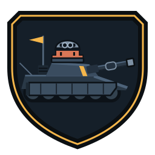
</p>

<h1 align="center">CLAUDE OF TANKS</h1>

<p align="center">
  Browser-native armored combat in <strong>pure Three.js</strong>: 121 first-party procedural vehicles,
  16 destructible battlefields, plate-level armor, physical gunnery, X-ray killcams,
  live multiplayer rooms, a production Scene Studio, and adaptive desktop/mobile rendering.
</p>

<p align="center">
  <a href="https://cot.kevinliu.studio"><strong>PLAY</strong></a>
  &nbsp;·&nbsp;
  <a href="https://cot.kevinliu.studio/docs">FIELD MANUAL</a>
  &nbsp;·&nbsp;
  <a href="https://cot.kevinliu.studio/gallery">TANK GALLERY</a>
  &nbsp;·&nbsp;
  <a href="docs/INDEX.md">ENGINEERING DOCS</a>
</p>

<p align="center">
  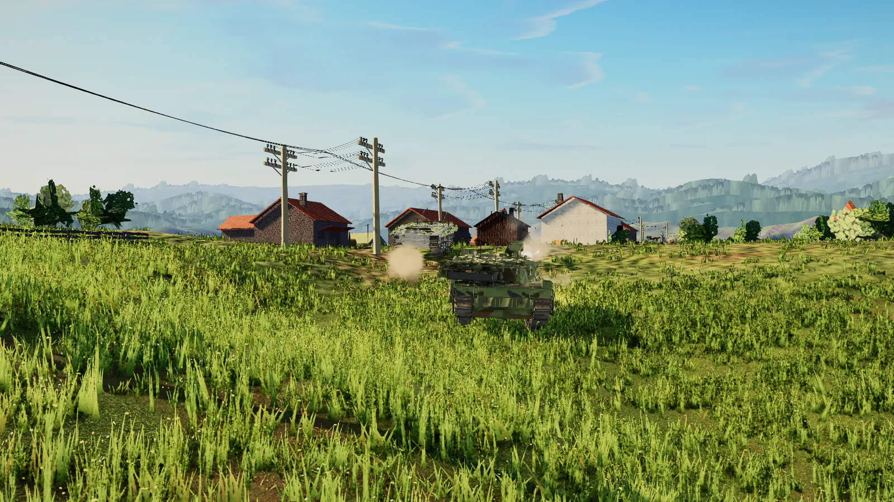
</p>

<table>
<tr>
<td width="33%">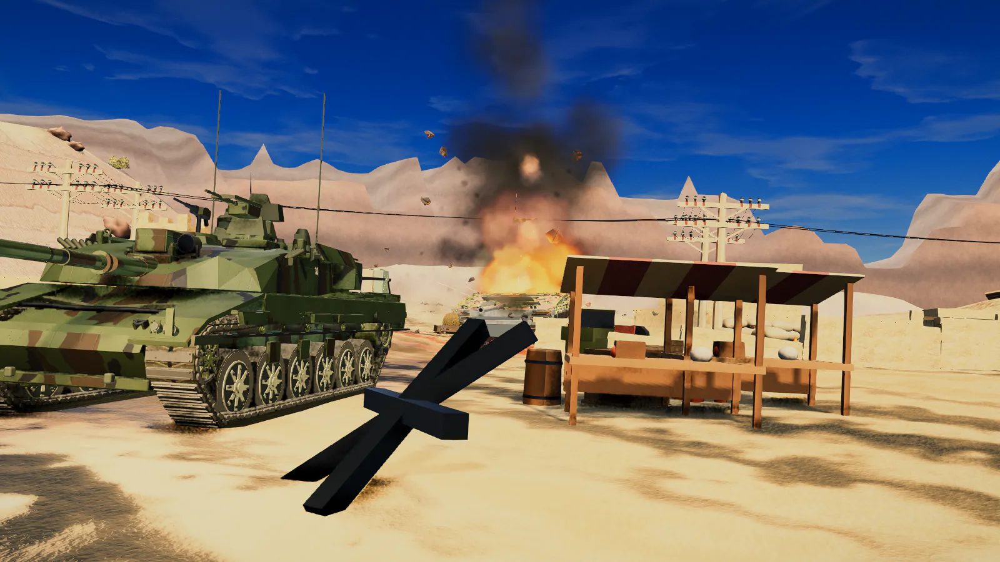</td>
<td width="33%">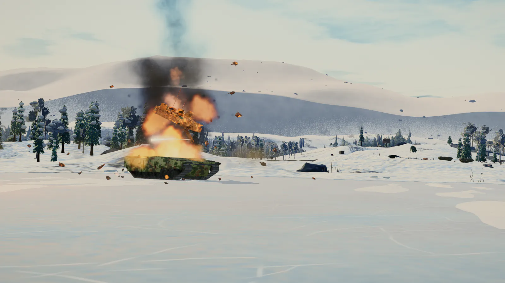</td>
<td width="34%">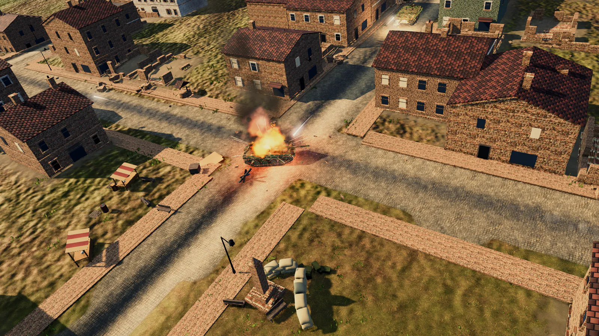</td>
</tr>
</table>

Every image above is a fresh deterministic capture from the shipped renderer. The new
[61-frame field archive](public/media/presentation-r1/manifest.json) contains 50 Scene Studio compositions and 11 live
game/interface states; it uses the real vehicles, maps, particles, debris, lighting, post stack, HUD, Gallery, and Studio.

## What ships

| | Current runtime |
| --- | --- |
| Fleet | **121** selectable first-party procedural vehicles; **0** GLB-sourced playables |
| Worlds | **16** authored battlefields with shared structures, wrecks, utility networks, loose props, placement, collision, and destruction |
| Authority | Fixed **60 Hz** movement, ballistics, armor, damage, spotting, bots, destructibles, and result |
| Presentation | Direct Three.js/WebGL renderer with a measured **120 FPS** certified path, adaptive quality, stable shadows, SMAA/FSR, and GPU recovery |
| Play | Solo bots, persistent private rooms, LAN rooms, room chat, spectators, rematches, and dedicated ranked authority |
| Platforms | Mouse/keyboard and complete touch controls with safe-area layout and device-adaptive rendering |
| Tools | Scene Studio, Tank Gallery, exact-surface review, deterministic capture, vehicle anatomy, and release gates |

The provenance gate currently reports **121 first-party procedural battle playables, 0 GLB-sourced playables, and 7
isolated comparison candidates**. Comparison inputs are never a playable loading path and are stripped from public builds.

## Combat, in pictures

<table>
<tr>
<td width="50%">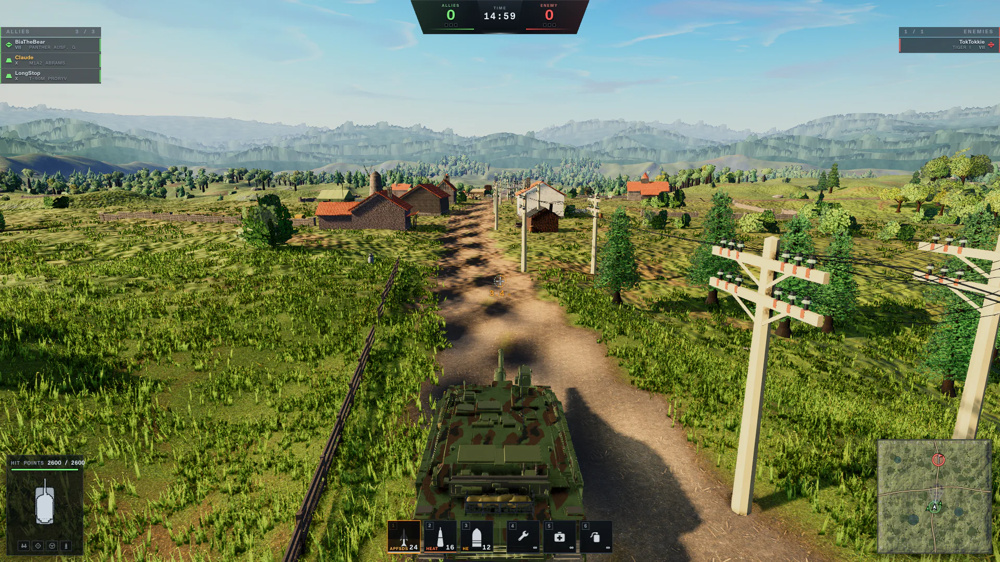<br><sub><b>Battle HUD:</b> dual reticle, ammunition, modules, teams, minimap, chat, performance, and authority-owned combat feedback.</sub></td>
<td width="50%">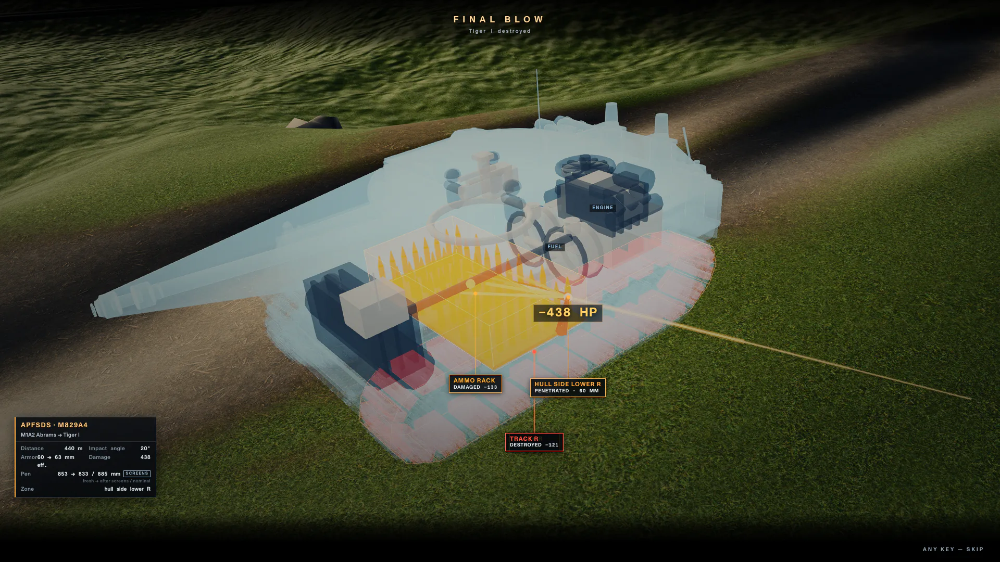<br><sub><b>X-ray killcam:</b> the resolved shell path, struck plate, effective protection, penetration result, damaged modules, and crew.</sub></td>
</tr>
<tr>
<td width="50%">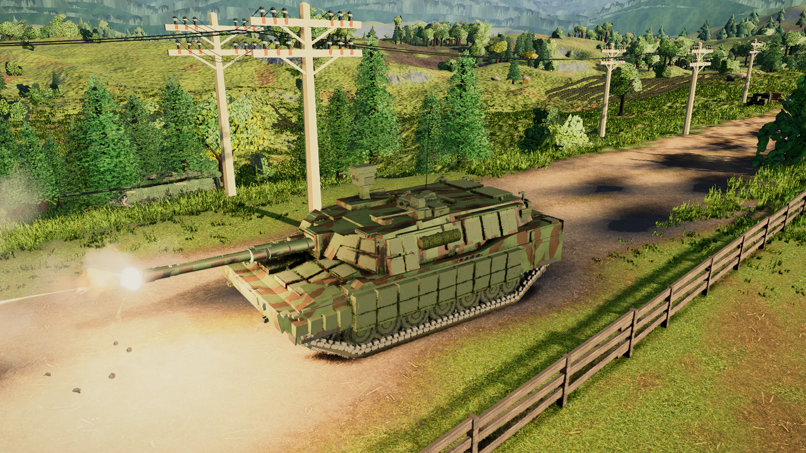<br><sub><b>Physical gunnery:</b> finite world aim, bore convergence, real muzzle transform, visible recoil, dispersion, travel time, and gravity.</sub></td>
<td width="50%">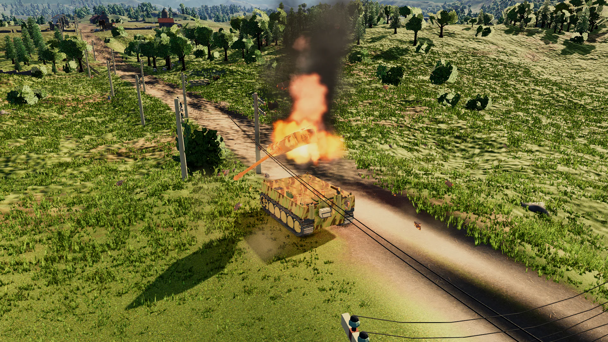<br><sub><b>Destruction:</b> fire, sparks, smoke, detached remnants, persistent wreck state, and pooled effects driven by the completed hit.</sub></td>
</tr>
</table>

- **Plate-level armor** resolves the actual plate, slope, impact angle, normalization, ricochet, overmatch, spaced armor,
  composites, ERA, and separate kinetic/chemical protection.
- **Five ammunition families** model muzzle velocity, gravity, penetration loss, ricochet, and damage differently.
- **Internal anatomy** tracks crew, ammunition racks, engine, fuel, gun, turret ring, optics, radio, and tracks.
- **Tank-specific mobility** combines drivetrain, terrain resistance, per-wheel support, suspension-damped hull attitude,
  flexible terrain-following tracks, collision, ramming, and crushable cover.
- **Real battlefield knowledge** combines view range, concealment, movement/firing bloom, foliage, radio sharing, and the
  15 m bush rule. Multiplayer authority filters hidden enemies before serializing a snapshot.

## Worlds and vehicle design

<table>
<tr>
<td width="50%">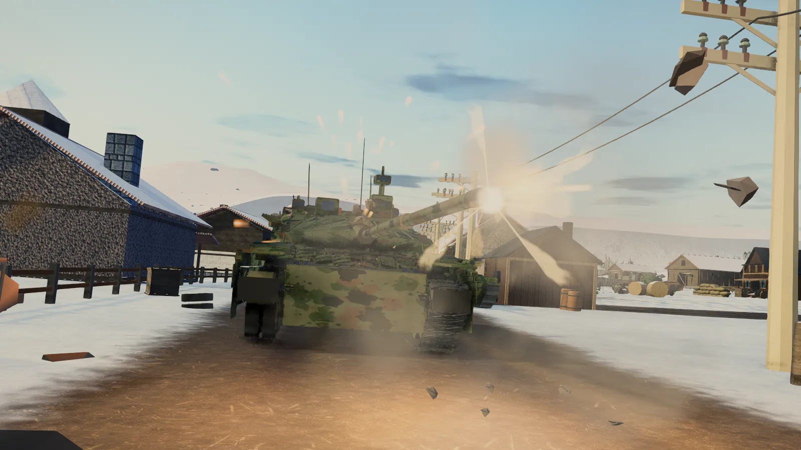<br><sub><b>Sixteen worlds:</b> terrain, roads, structures, foliage, fog, sky, lighting, cover, collision, minimap, and dedicated-server descriptors.</sub></td>
<td width="50%">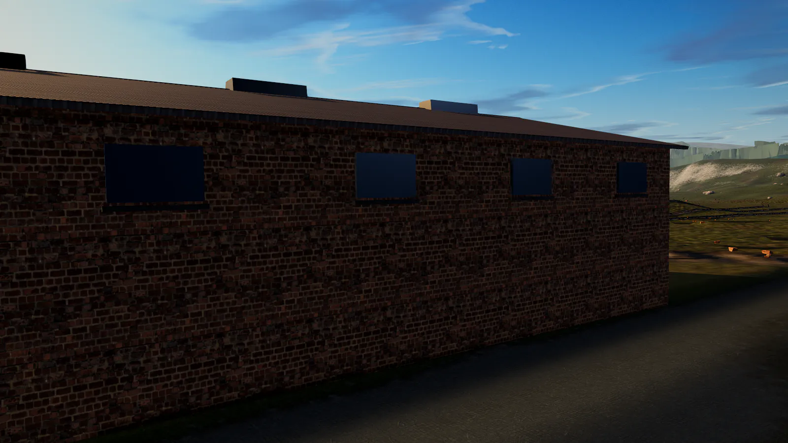<br><sub><b>Shared world kit:</b> destructible buildings, camps, wreck families, debris, utility lines, loose physical props, and narrow hitboxes.</sub></td>
</tr>
<tr>
<td width="50%">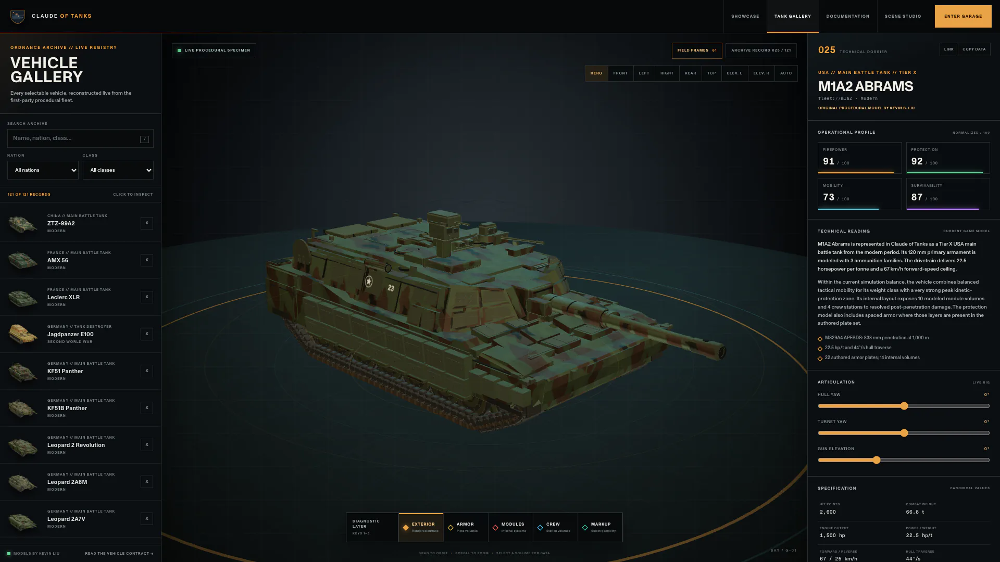<br><sub><b>Tank Gallery:</b> search 121 records, orbit and articulate the live rig, inspect armor/modules/crew, and export exact-surface review packets.</sub></td>
<td width="50%">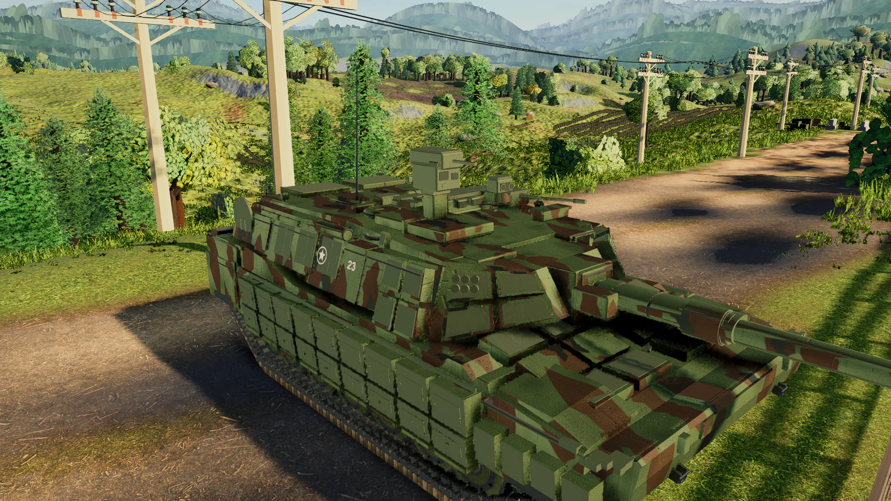<br><sub><b>One vehicle specification:</b> geometry, armor, modules, gun limits, ammunition, mobility, garage cards, bots, icons, diagrams, Gallery, and Studio.</sub></td>
</tr>
</table>

Every playable hull, turret, gun, fitting, suspension, road wheel, and track run is assembled by the repository's
first-party vehicle pipeline. Vehicle changes pass combat-anatomy receipts, generated technical diagrams, geometry
checks, visual fingerprints, and a targeted release gate.

## Renderer, drivers, and performance

The renderer treats quality as a device contract instead of a single desktop preset. It selects a GPU/driver-aware
profile, caps pixel density, prewarms shader paths, adapts costly effects, and can recover from a black frame or WebGL
context loss. The current presentation path combines:

- four quality-scaled, stable texel-anchored shadow cascades with articulation-aware tank shadow hulls;
- fused output grading, anti-aliasing, adaptive render scale, fog/atmosphere, and bounded transparent depth work;
- instance/batch paths for repeated world objects, pooled particles, and explicit GPU resource disposal;
- reusable hot-loop scratch state, fixed-step simulation, render interpolation, and high-refresh presentation;
- an in-game diagnostics surface for FPS, ping, frame timing, draw calls, triangles, memory, network telemetry, quality,
  and renderer/driver identity.

**120 FPS is a measured certified path, not a universal promise.** Refresh rate, browser, thermal limits, GPU/driver,
resolution, and quality level still determine the achieved rate. Combat rules remain fixed at 60 Hz at every render rate.

<table>
<tr>
<td width="50%">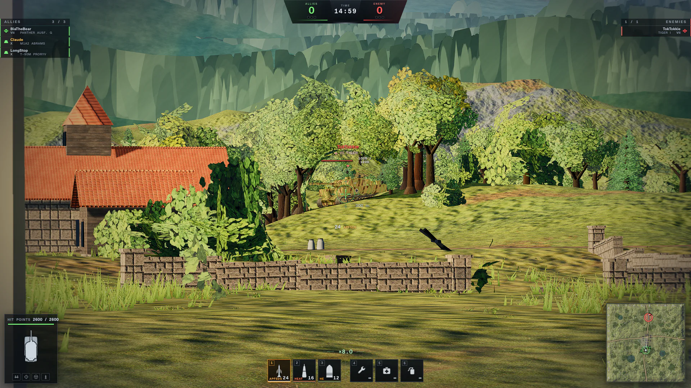<br><sub><b>Presentation:</b> high-resolution scope, stable shadowing, post AA, bounded depth copies, and readable combat overlays.</sub></td>
<td width="50%">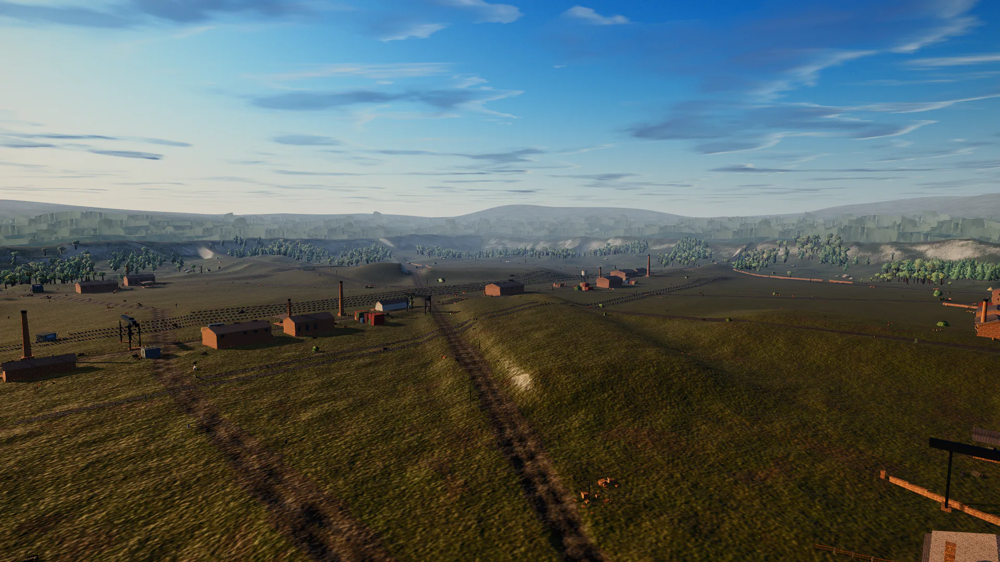<br><sub><b>World scale:</b> authored layouts and dense dressing remain behind adaptive quality, instancing, culling, and streaming policy.</sub></td>
</tr>
</table>

## Multiplayer and mobile

Local, LAN, browser-hosted private, and dedicated ranked modes share the same renderer-free movement and combat rules.
Clients send intent, never trusted hits or damage. Snapshot filtering, local prediction/reconciliation, bounded remote
interpolation, reliable fire edges, reconnectable room state, and separate control/chat delivery keep a moving and firing
7v7 battle responsive without giving the client authority.

<table>
<tr>
<td width="62%">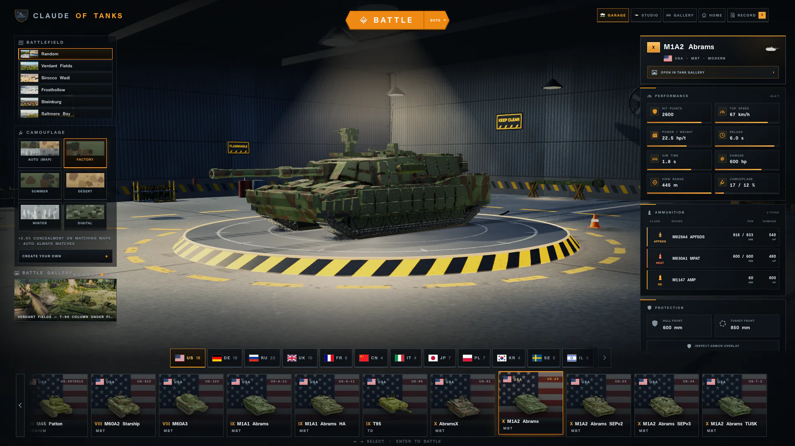<br><sub><b>Desktop:</b> nation rail, vehicle deck, map and camouflage previews, dossiers, equipment, local profile, settings, and multiplayer rooms.</sub></td>
<td width="38%">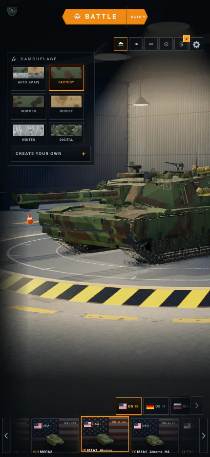<br><sub><b>Mobile:</b> safe-area layout, touch-sized command surfaces, joystick/swipe aim, pinch-to-scope, dynamic fire, and adaptive graphics.</sub></td>
</tr>
</table>

## Production tools

<table>
<tr>
<td width="50%">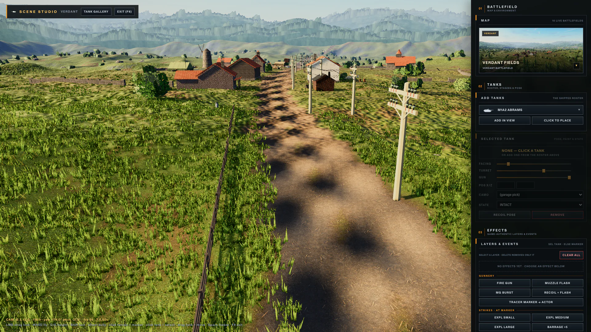<br><sub><b>Scene Studio:</b> place any roster vehicle on any map, conform it to terrain, pose it inside physical limits, stage game-authentic effects on deterministic time, and capture the production renderer.</sub></td>
<td width="50%">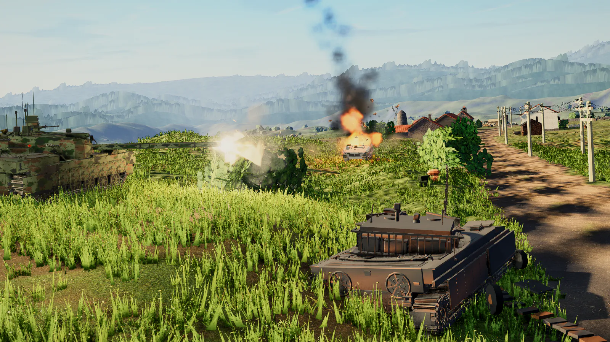<br><sub><b>Reproducible imagery:</b> vehicles, camos, camera, lighting, recoil, tracers, explosions, sparks, smoke, debris, wrecks, and timeline are scene data—not composited concept art.</sub></td>
</tr>
</table>

Regenerate the current public archive:

```bash
node tools/marketing-shots/gen-presentation-r1.mjs
node tools/marketing-shots/shoot.mjs \
  --scenes tools/marketing-shots/scenes-presentation-r1 \
  --out shots/presentation-r1/raw --width 1600
node tools/screenshot.mjs \
  --out shots/presentation-r1/ui-raw \
  --views garage,player_view,sniper_view,tank_closeup_modern,combat_firing,explosion,battlefield_foundry,killcam_xray \
  --width 1920 --height 1080
node tools/marketing-shots/capture-presentation-ui.mjs
node tools/marketing-shots/publish-presentation-r1.mjs
```

The capture harness serializes concurrent jobs, launches a clean local game, verifies the requested state, and records
current render diagnostics. `public/media/presentation-r1/manifest.json` is the public archive contract.

## Architecture

```text
controls ──► deterministic authority ──► filtered state + reliable events ──► presentation
                 │                                                           │
                 ├─ movement / terrain / collision                            ├─ procedural vehicles
                 ├─ aim / ballistics / armor / anatomy                        ├─ tracks / suspension / FX
                 ├─ spotting / concealment / bots                             ├─ HUD / audio / killcam
                 └─ destructibles / match result                              └─ Three.js / post / Studio
```

```text
src/engine/    renderer, camera, lighting, post, quality, telemetry, GPU recovery
src/world/     sixteen maps, terrain, vegetation, props, collision, destruction
src/vehicles/  specs, procedural geometry, materials, profiles, asset proofs
src/sim/       DOM-free movement, aiming, ballistics, armor, damage, spotting
src/game/      local composition, bots, input, profile, killcam, Scene Studio
src/net/       protocol, rooms, chat, snapshots, prediction, WebRTC/WebSocket
src/ui/        garage, battle HUD, reports, settings, diagnostics, touch controls
server/        signaling, persistent rooms, dedicated authority, ranked service
```

Start with [Technical overview](docs/TECHNICAL-OVERVIEW.md), [Product features](docs/FEATURES.md),
[How it works](docs/HOW-IT-WORKS.md), [Multiplayer architecture](docs/MULTIPLAYER-ARCHITECTURE.md),
[Performance](docs/PERFORMANCE.md), [Scene Studio](docs/STUDIO.md), and [Tank Gallery](docs/GALLERY.md).

## Develop and verify

```bash
npm install
npx vite
npm test
npm run test:net:browser
npm run tank:native:check
npm run build
npm run build:private
```

The public build strips quarantined comparison assets. Simulation, networking, browser multiplayer, maps, collision,
destruction, rendering policy, UI, mobile controls, vehicle provenance, anatomy, generated assets, and both build variants
have executable checks.

## Credits and licensing

Created, designed, and directed by **Kevin B. Liu** through a long-running Claude/Codex development pipeline spanning
research, vehicle authoring, simulation, networking, design, performance, QA, documentation, and deployment. Claude and
Codex were development tools, not co-authors or copyright holders.

All gameplay code and every selectable procedural vehicle model are original first-party work by Kevin B. Liu. See
[`NOTICE.md`](NOTICE.md), [`LICENSE`](LICENSE), and [`docs/ATTRIBUTION.md`](docs/ATTRIBUTION.md). External models may be
retained only as quarantined research references; they are never loaded as playable geometry.
