<p align="center">
  
</p>

<h1 align="center">CLAUDE OF TANKS</h1>

<p align="center">
  A World of Tanks-style armored combat game in <strong>pure Three.js</strong> — plate-level armor simulation,
  80 original first-party vehicles, eight destructible battlefields, killcam X-ray, a built-in cinematic studio,
  and full mobile support. Built end-to-end through a long-running multi-agent Claude/Codex pipeline.
</p>

<p align="center">
  <a href="https://cot.kevinliu.studio"><strong>PLAY IN THE BROWSER</strong></a>
  &nbsp;·&nbsp;
  <a href="docs/HOW-IT-WORKS.md">HOW IT WORKS</a>
  &nbsp;·&nbsp;
  <a href="https://cot.kevinliu.studio/gallery">TANK GALLERY</a>
  &nbsp;·&nbsp;
  <a href="docs/INDEX.md">DOCUMENTATION</a>
</p>

<table>
<tr>
<td width="33%"></td>
<td width="33%">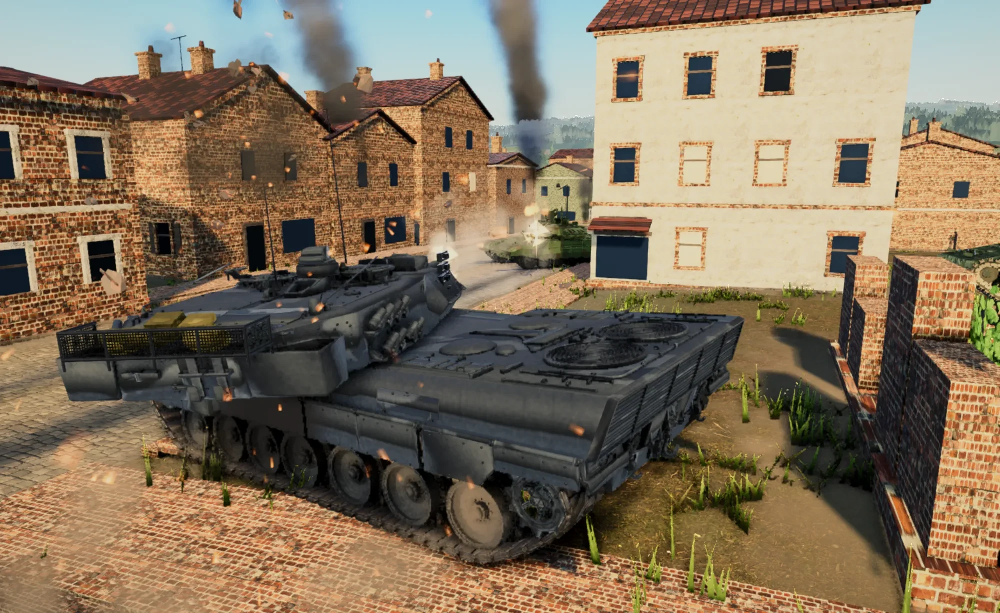</td>
<td width="34%">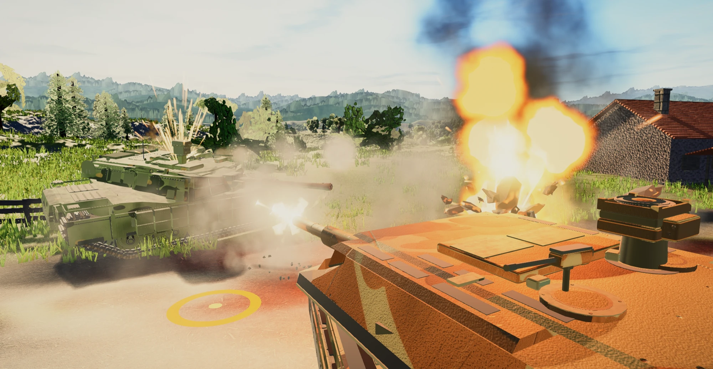</td>
</tr>
</table>

<p align="center">
  <a href="public/media/featured/claude-of-tanks-gameplay.mp4">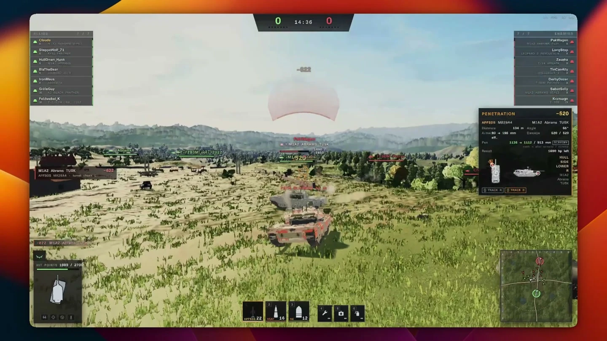</a>
</p>
<p align="center"><strong>Watch the 99-second gameplay film</strong> — garage, deployment, live combat, penetration feedback, killcam, and the after-action report.</p>

## The game

Claude of Tanks is a Vite-powered, engine-free armored combat simulator that runs entirely in a modern browser—no
install, account, native runtime, currency, XP grind, or tech tree. Pick any vehicle, choose a battlefield, and enter a
bot, private-room, LAN, or ranked battle.

The selectable fleet contains **80 original procedural vehicles**. Gameplay never loads third-party tank geometry:
every playable hull, turret, gun, fitting, suspension, and track run is authored in the repository and assembled by the
first-party vehicle pipeline. Historical source models are quarantined comparison material and are stripped from public
builds.

Every mode advances the same **60 Hz movement and combat rules**. Solo composes those rules directly in the browser for
the fastest latency-free path; LAN, private, and ranked play place the renderer-free authority behind the network
protocol. Three.js presents the result; it does not decide it.

## What makes it different

- **Plate-level armor:** slope, impact angle, normalization, ricochet, caliber overmatch, spaced armor, composites,
  ERA, and kinetic/chemical protection are resolved separately.
- **Physical gunnery:** center-screen world aim, real turret traverse and gun elevation/depression, actual muzzle
  ballistics, five shell classes, bloom, travel time, gravity, and distance behavior.
- **Internal damage:** crew, ammunition rack, engine, fuel, tracks, radio, optics, repair, fire, and catastrophic kills.
- **Real visibility:** view range, concealment, movement/firing bloom, foliage, radio sharing, and the 15 m bush rule.
- **Terrain-shaped mobility:** fixed-step drivetrain, slopes and ground resistance, suspension-damped hull attitude,
  per-wheel support, flexible terrain-following tracks, collision, ramming, and crushable cover.
- **Eight generated battlefields:** Verdant Fields, Sirocco Wadi, Frosthollow, Steinburg, Saltmere Bay, Amberford,
  Tarkhan Steppe, and Cinder Junction.
- **Combat feedback:** dual reticle, penetration information, directional hits, shot cards, module damage, spectating,
  and an X-ray killcam built from the resolved shot.
- **Desktop and mobile:** remappable mouse/keyboard controls plus joystick, swipe aim, pinch-to-scope, dynamic fire,
  safe-area layout, and device-adaptive rendering.

## Technical achievements

| System | What the project implements |
|---|---|
| Browser-native engine | Direct Three.js rendering, generated worlds, custom tank movement, post-processing, particles, audio, and device recovery without a commercial game-engine runtime |
| Combat authority | Fixed 60 Hz movement, finite-point aiming, physical muzzle ballistics, plate armor, internal modules, spotting, bots, destructibles, and match outcome |
| Original fleet | 80 selectable first-party procedural vehicles, generated presentation assets, live geometry fingerprints, and zero GLB-sourced playable tanks |
| Network play | Protocol-v4 intent validation, viewer-filtered state, low-latency replaceable input, dedicated WebSocket authority, prediction, reconciliation, and reconnectable room state |
| Persistent rounds | Invite links, teams, spectators, ready locks, after-action rematch voting, garage room presence, and non-host rejoin while the browser host remains authoritative |
| Performance | A direct solo path, isolated public routes, adaptive rendering, idle warmup, reusable snapshot storage, bounded cosmetic event work, and GPU black-frame recovery |
| Production tools | A deterministic in-game Scene Studio, Tank Gallery geometry markup, fleet icon/diagram generation, browser multiplayer rigs, and public/private artifact verification |

The detailed, code-linked feature catalog is in
[Product features and technical achievements](docs/FEATURES.md).

## Battle modes

**Bots** runs the original fast in-page simulation without loading networking code. Bots use shared movement, spotting,
terrain navigation, randomized seeded openings, traffic avoidance, and stall recovery.

**Private rooms** use six-character codes and shareable invite links. Players can switch teams, spectate, choose a
vehicle, ready up, fight, vote to play again, and rematch without destroying the room. **LAN** uses the same room flow
over direct Wi-Fi WebRTC paths. **Ranked** moves authority to the dedicated service and records server-owned rating.

WebRTC separates reliable control and combat events from replaceable 20 Hz snapshots and live input. Fire and consumable
edges repeat until authority acknowledges them, while stale steering coalesces instead of blocking newer controls. Local
movement predicts the same integrator and reconciles against authority; remote tanks interpolate a bounded snapshot buffer. Sub-centimeter
terrain/contact noise is held only while a hull is genuinely parked, without freezing turret or gun articulation, and
real input or authority motion releases the hold immediately. The complete design is in
[`docs/MULTIPLAYER-ARCHITECTURE.md`](docs/MULTIPLAYER-ARCHITECTURE.md).

## Controls

| Action | Default |
|---|---|
| Drive / steer | `W A S D` or arrow keys |
| Handbrake | `Space` |
| Aim / fire | Mouse / left mouse |
| Sniper mode | `Shift`, configurable `RMB`, or mouse wheel |
| Shell slots | `1` `2` `3` |
| Repair / first aid / extinguisher | `4` `5` `6` |
| Minimap zoom / shot log | `M` / `L` |
| Settings | `Esc` |

All bindings are remappable. Touch devices receive the complete mobile control layout automatically.

## Modern fleet showcase

These frames are deterministic captures from the shipped Scene Studio and live renderer. They use the actual playable
vehicles, battlefields, lighting, particles, explosions, debris, and post-processing—no generative art or substituted
reference models.

<table>
<tr>
<td width="50%">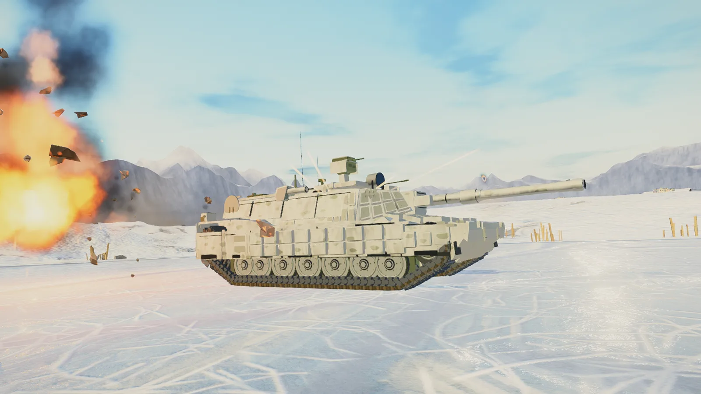</td>
<td width="50%">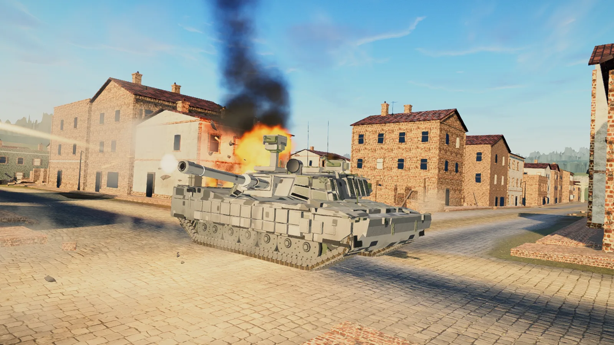</td>
</tr>
<tr>
<td width="50%">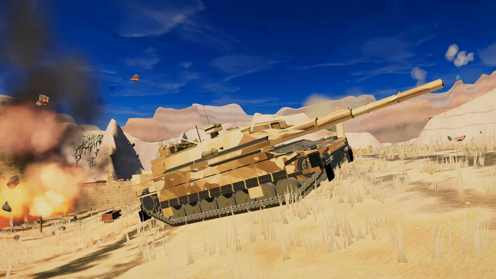</td>
<td width="50%">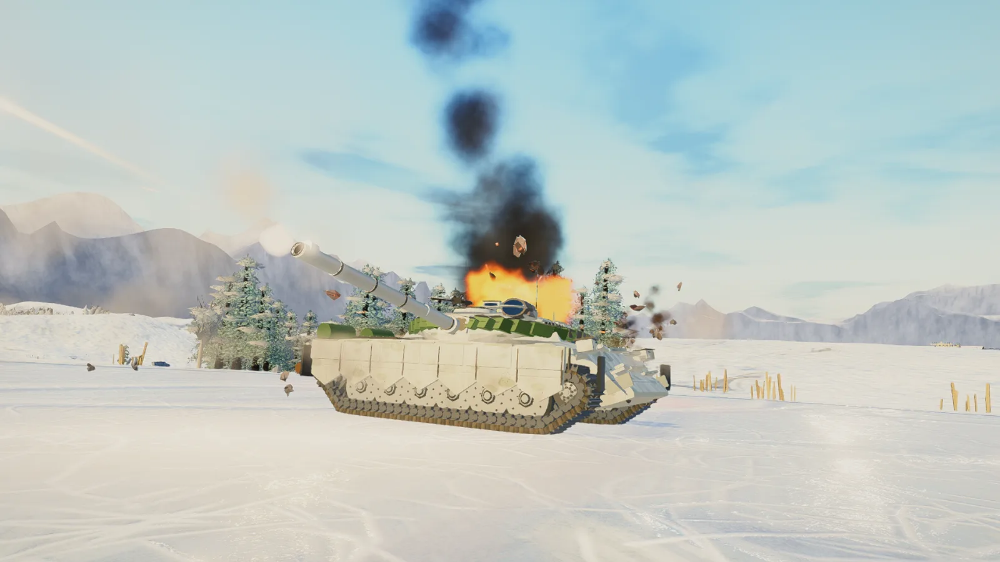</td>
</tr>
<tr>
<td width="50%">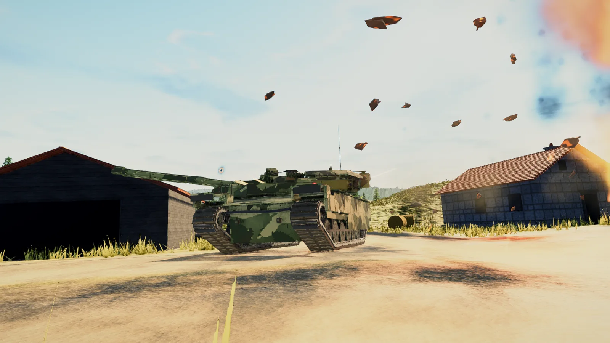</td>
<td width="50%">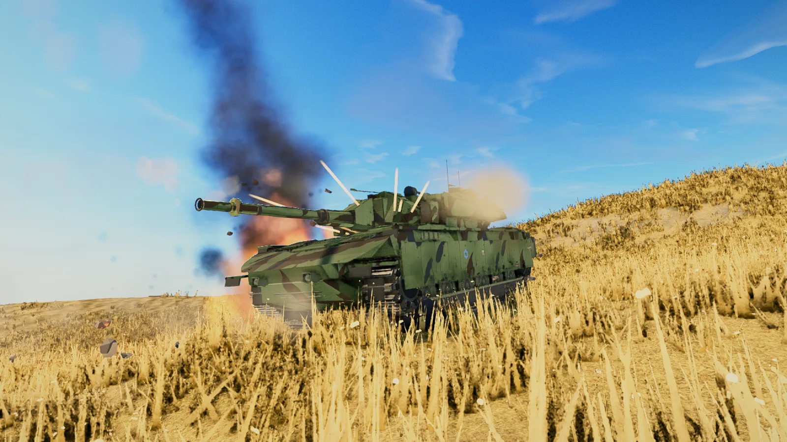</td>
</tr>
</table>

The landing page presents all 30 new frames with nation filters and full-screen inspection.

## Systems in view

The public presentation also uses direct captures of the shipped interfaces and tools. These are not design mockups:
they show the production garage, battle HUD, sniper view, killcam, Scene Studio, and Tank Gallery markup tools.

<table>
<tr>
<td width="50%">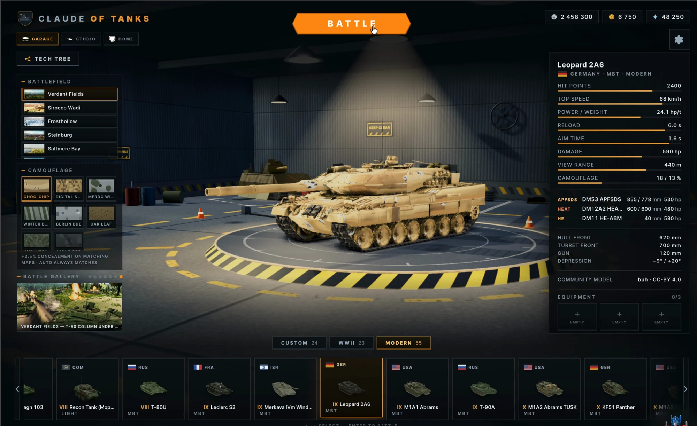<br><sub><b>Garage:</b> first-party fleet, nation ordering, vehicle cards, equipment, maps, and battle modes.</sub></td>
<td width="50%">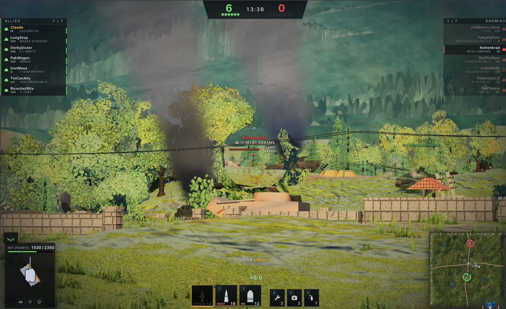<br><sub><b>Battle:</b> dual reticle, ammunition, vehicle state, teams, minimap, and resolved combat feedback.</sub></td>
</tr>
<tr>
<td width="50%">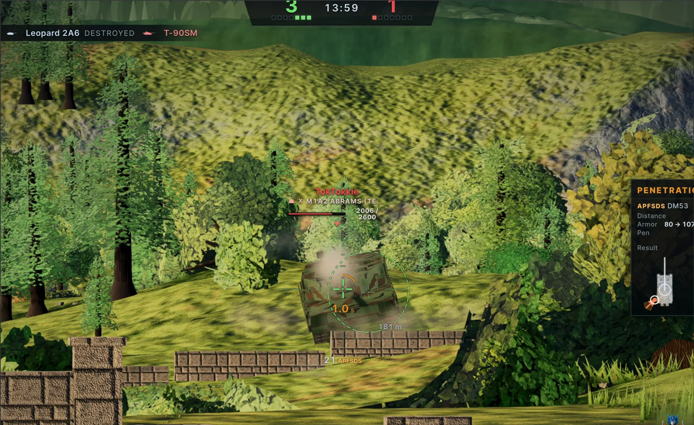<br><sub><b>Gunnery:</b> finite center aim, actual bore solution, zoom, dispersion, range, and penetration information.</sub></td>
<td width="50%">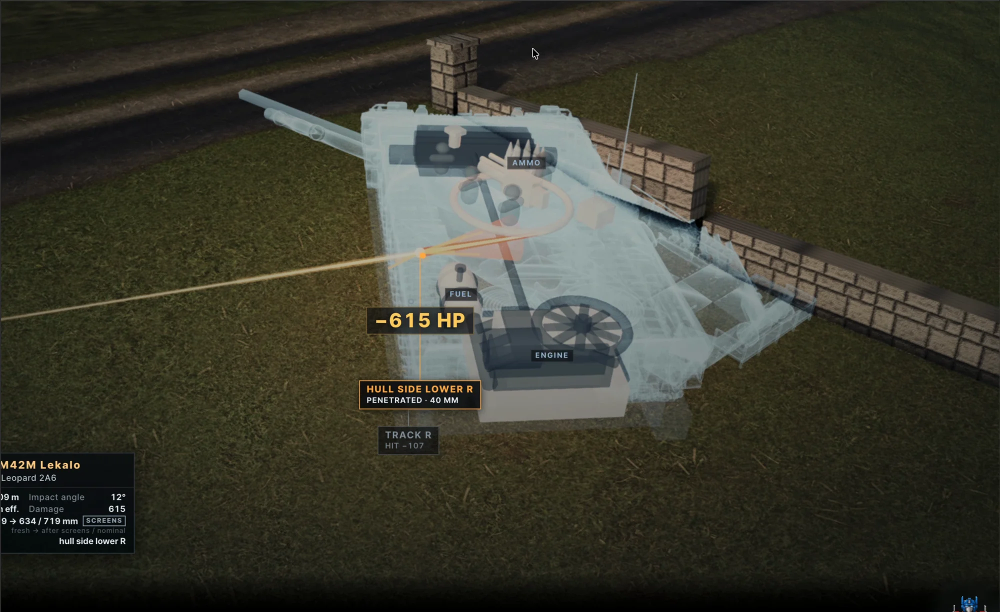<br><sub><b>Killcam:</b> shell path, struck plate, effective protection, penetration, and internal damage.</sub></td>
</tr>
<tr>
<td width="50%">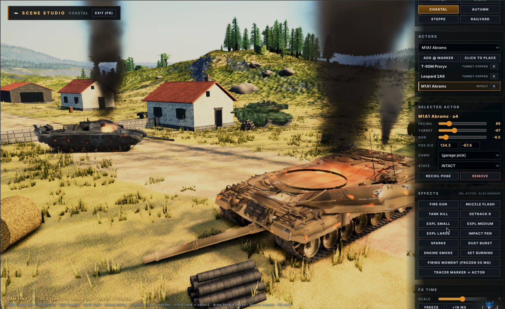<br><sub><b>Scene Studio:</b> actual worlds, vehicles, poses, effects, deterministic time, and production capture.</sub></td>
<td width="50%">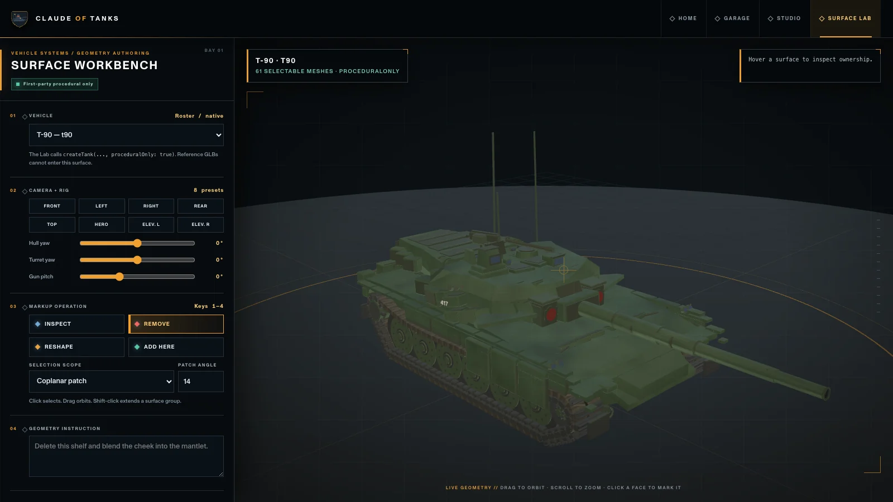<br><sub><b>Tank Gallery markup:</b> exact geometry selection, articulation ownership, annotations, and portable review packets alongside fleet dossiers.</sub></td>
</tr>
</table>

## Scene Studio

Open `/studio` or press `F8` in the garage. Studio can place roster vehicles on any map, conform them to terrain, pose
hulls/turrets/guns inside physical limits, apply camouflage or damage, stage real firing/destruction effects on a
deterministic timeline, and capture through the production renderer.

The modern showcase is reproducible:

```bash
node tools/marketing-shots/gen-modern-showcase.mjs
node tools/marketing-shots/shoot.mjs \
  --scenes tools/marketing-shots/scenes-modern \
  --out shots/marketing-modern/raw --width 1600
node tools/marketing-shots/encode-modern-showcase.mjs
```

## Architecture

```text
controls ──► deterministic authority ──► state + reliable events ──► presentation
                 │                                                   │
                 ├─ movement / terrain / collision                    ├─ first-party vehicles
                 ├─ aim / ballistics / armor / modules                ├─ tracks / suspension / FX
                 ├─ spotting / concealment / bots                     ├─ HUD / audio / killcam
                 └─ destructibles / result                            └─ Three.js / post
```

```text
src/engine/    renderer, camera, lighting, post, quality and GPU recovery
src/world/     eight generated maps, terrain, vegetation, props and destructibles
src/vehicles/  specs, first-party procedural geometry, materials and asset proofs
src/sim/       renderer-free movement, aiming, ballistics, armor, damage and spotting
src/game/      application state, AI, input, killcam and Scene Studio
src/net/       protocol v4, rooms, snapshots, prediction, WebRTC and WebSocket adapters
src/ui/        garage, battle HUD, room flow, reports, settings and mobile controls
server/        signaling, distributed room store, dedicated authority, rating and ranked queue
```

The renderer uses four quality-scaled cascaded shadow maps with stable texel-anchored filtering. Tanks submit up to three
articulation-aware convex shadow hulls derived from their authored geometry, so hull, turret, and gun silhouettes remain
recognizable without sending thousands of decorative triangles through every shadow cascade.

Start with [Technical overview](docs/TECHNICAL-OVERVIEW.md),
[Product features](docs/FEATURES.md), and
[How it works](docs/HOW-IT-WORKS.md). Engineering work continues in
[Internal systems](docs/SYSTEMS.md),
[Development and verification](docs/DEVELOPMENT.md),
[Multiplayer architecture](docs/MULTIPLAYER-ARCHITECTURE.md),
[Performance architecture](docs/PERFORMANCE.md), and
[Scene Studio](docs/STUDIO.md). The public [Tank Gallery](https://cot.kevinliu.studio/gallery)
and its [implementation contract](docs/GALLERY.md) expose the live procedural
fleet with armor, module, crew, and exact-surface markup diagnostics. Historical fleet-program ledgers and the original implementation contract remain
under docs/ as an auditable build record; they are not the current product guide.

## Develop and verify

```bash
npm install
npx vite
npm test
npm run test:net:browser
npm run tank:native:check
npm run build
npm run build:private
```

The public build also strips quarantined comparison assets. Vehicle provenance, generated icons, track geometry,
simulation rules, networking, browser multiplayer, and both build variants have executable checks.

## Credits and licensing

Created and directed by **Kevin Liu** through a long-running multi-agent Claude/Codex development pipeline spanning
research, vehicle authoring, simulation, networking, design, performance, QA, documentation, and deployment.

All gameplay code and selectable vehicles are original first-party work. External models may be retained only as
quarantined visual references for research and verification; they are never loaded as playable geometry. No assets
extracted from commercial games are used. See [`docs/ATTRIBUTION.md`](docs/ATTRIBUTION.md) for the complete asset record.
