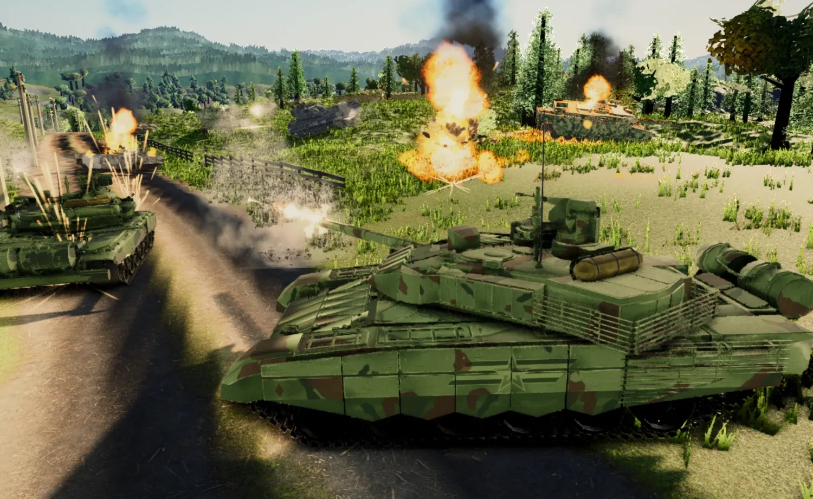

# Claude of Tanks



A World of Tanks-style armored combat game built in pure Three.js, developed by a
long-running multi-agent pipeline: parallel research → subsystem builders →
harsh visual-critic loops with per-dimension fix agents.

Roughly 63,000 lines of JavaScript across `src/`, 91 playable vehicles in the
private/local roster, four
battle maps, a plate-level armor simulation, kill cams with x-ray shot analysis,
and a WoT-authentic HUD.

## Running it

```bash
npx vite
```

Then open the printed localhost URL in a normal browser (Chrome/Safari/Firefox).
Embedded webviews are supported too — the game detects when pointer lock is
unavailable and falls back to cursor aim automatically.

## Controls (defaults; all rebindable)

| Action | Bind |
|---|---|
| Drive forward / back | `W` / `S` |
| Turn hull left / right | `A` / `D` |
| Aim turret | Mouse (mouselook when captured, cursor-follow when not) |
| Fire | Left mouse button |
| Sniper mode | `Shift` (right mouse button in cursor-aim mode) |
| Free look | Right mouse button (desktop) |
| Shell 1 / 2 / 3 | `1` / `2` / `3` |
| Settings / menu | `Esc` (or the gear icon in the garage) |

Every binding is remappable in **Settings → Controls** (click a chip, press the
new key; conflicts are detected and offered as a swap). Mouse sensitivity,
invert-Y, and sniper sensitivity scaling live in **Settings → Gameplay**.
Bindings persist to `localStorage` under `cot.bindings.v1`.

## Simulation

The combat model is transcribed from World of Tanks mechanics research
(`docs/research/armor-penetration.md`, `docs/research/shells-ballistics.md`) and
verified by `src/sim/combat.selftest.mjs`:

- **Armor:** per-plate geometry with real thickness and slope; effective
  thickness via `nominal / cos(impact angle)` with a slope exponent; shell
  normalization (AP 5°, APCR/HEAT 2°, APFSDS rod-effective); ricochet gates
  (70°/78°/85°, HE never); 3× and 2× caliber overmatch including APFSDS
  rod-diameter handling; spaced armor and screens.
- **Modern armor:** composite RHAe tracked separately against kinetic and
  chemical energy, one-shot ERA blocks, HEAT standoff decay.
- **Shells:** AP, APCR, HEAT, HE, APFSDS with per-type muzzle velocity, travel
  time, gravity drop, distance falloff, and HE splash (`0.5·dmg·(1−d/R) −
  1.1·armor`).
- **RNG:** ±25% penetration and damage rolls, once per shot, in WoT's order.
- **Modules and crew:** ammo rack, engine, fuel, tracks, radio, viewports and
  crew roles with individual HP, save throws, repair timers, and fire chances.
- **Spotting:** the real concealment formula
  `spotRange = viewRange − (viewRange − 50) · camo`, with firing bloom, bush
  concealment, the 15 m rule, per-class camo values, and a sixth-sense lamp.
  AI acquires targets only through this system (`src/sim/spotting.js`,
  verified by `spotting.selftest.mjs`).
- **Movement:** power-to-weight acceleration gated by terrain resistance tiers,
  pivot vs. drive turns, slope stall and downhill overspeed, hull pitch/roll
  from a multi-point terrain support solve, recoil impulse, turret traverse and
  gun elevation limits, and dispersion bloom feeding real shell dispersion.

## Roster

**Core (procedural + sourced):** M4A3E8 Sherman, Tiger I, T-34-85, IS-2,
Panther Ausf. G, M1A2 Abrams SEPv3, T-90M, Leopard 2A7, Strv 103.

**Modern (24 vehicles):** M1A1 / M1A2 SEPv3 / M1A2 TUSK, Leopard 2A4 / 2A6 /
2A7 / 1A5, T-72B3, T-80U, T-90A, T-90M, T-14 Armata, Challenger 2, Chieftain
Mk10, Leclerc, Merkava Mk4, Type 99A, K2 Black Panther, Type 10, Type 74,
C1 Ariete, KF51 Panther, M60A3, plus Bradley and BMP-2 IFVs.

**Community:** KV-2, Tiger II, Sherman Jumbo, Jagdtiger, Jagdpanzer E-100,
Sturmtiger, T95, T30, IS-7, IS-6B, IS-1, Object 279, Panzer III variants,
Leichttraktor, Recon Tank, and more. The recovered local fleet adds AbramsX,
Tejas's M1A2, Challenger 1, Chieftain Mk.5, Warrior, Leopard 2 variants,
M1A1HA/SEPv2, M60A1/A3, PT-91M, seven Merkava variants, T-62/T-64/T-72/T-90
variants, Type 90, ISU-122S/152, Centurions, Comet, Charioteer, early Pattons,
Pershings, and several m_bergman print-pack variants.

Vehicles are a judged mix of **sourced CC-BY/CC0 models** (winners of
side-by-side render-offs against our procedural builds) and **procedural
constructions** built from real dimensions and armor layouts. Every sourced
asset is credited in [`docs/ATTRIBUTION.md`](docs/ATTRIBUTION.md); models under
non-commercial or personal-use licenses are used freely — this is a private,
local, non-commercial project and nothing is distributed.

The 42 newest recovered model assets are explicitly local-only because their
licenses are NC/ND or were not preserved well enough to clear redistribution.
Their gameplay rows remain available in every build: public builds use the
closest built-in procedural family visual and distributable family icons,
while `npx vite` / `npm run build:private` use the recovered GLBs and exact
derivative icons. `npm run build` / `npm run build:public` strip only the
restricted models and their derivative renders.

No assets extracted from commercial games are used. During sourcing, many
candidate uploads were declined on provenance (commercial-game extractions,
warez-site watermarks, and laundered re-exports), documented in the
attribution file.

## Maps

Four distinct battlefields, each with its own heightmap, splat palette,
vegetation set, prop layout, sky/fog preset, spawns, and minimap: **Verdant
Fields** (grassland village), **Sirocco Wadi** (desert mesas), **Frosthollow**
(winter alpine), **Steinburg** (urban grid). Pick one in the garage or roll
Random.

## Features

- **Garage** with tank carousel, era filters (WWII / Modern / Community), camo
  picker per vehicle, stats cards, and a multi-nation **tech tree** with tier
  ladders and author credits.
- **Kill cams:** on your death (and your battle-winning shot), a slow-motion
  tracer replay followed by an x-ray view — ghosted hull, shell path drawn
  through the internals, damaged modules highlighted, with shell/angle/effective
  armor/roll annotations pulled from the real resolved hit event.
- **Shot info panels:** per-shot cards showing result (penetration / non-pen /
  ricochet / splash), distance, impact angle, nominal vs. effective armor, your
  pen roll, damage, and an armor diagram with the hit point marked. Every number
  traces to a sim event — verified by scripted live-fire audits.
- **Effects:** layered muzzle flash with bore-anchored jet, per-type tracers,
  spall and ricochet sparks, HE dirt plumes, staged fires, ammo-rack turret
  pops, de-track ribbons, track dust wakes, and persistent smoke columns.

## Tooling

| Command | Purpose |
|---|---|
| `node tools/screenshot.mjs` | Capture all 16 deterministic views to `shots/` (must exit 0 with zero console errors) |
| `node tools/controls-probe.mjs` | Controls regression gate — 38 assertions across pointer-lock and cursor-aim modes |
| `node tools/perfprobe.mjs` | FPS / draw calls / triangles / heap / load-time measurement at both display scales |
| `node tools/genIcons.mjs` | Regenerate per-vehicle icons (top-down, 3/4 angle, side profile + silhouettes) |
| `node src/sim/combat.selftest.mjs` | Armor/penetration/shell math assertions |
| `node src/sim/spotting.selftest.mjs` | Concealment and spotting assertions |

Screenshot contract: [`docs/SCREENSHOT_CONTRACT.md`](docs/SCREENSHOT_CONTRACT.md).
Architecture and module interfaces: [`docs/ARCHITECTURE.md`](docs/ARCHITECTURE.md).
Independent evaluation: [`docs/EVALUATION.md`](docs/EVALUATION.md).

## Architecture

```
src/engine/    renderer, lighting (CSM), post chain, procedural sky, camera rig
src/world/     terrain, vegetation, props, horizon, four map configs
src/vehicles/  specs (stats + armor zones), procedural factory, GLB loader, materials/camo
src/sim/       ballistics, armor resolution, damage, movement, spotting (+ selftests)
src/fx/        muzzle flash, tracers, impacts, explosions, destruction, particles
src/ui/        HUD, garage, tech tree, settings, damage panel, shot info
src/game/      state, AI, input layer, kill cam
src/main.js    integration: startup order, game flow, update loop, screenshot hooks
```

Sim modules are pure logic and run under plain `node`; rendering never leaks
into them, which is what makes the self-tests possible.

## Honest status

The visual-critic loop scored 12 dimensions each round against real WoT
footage, with a pass bar of 8.5/10. After seven rounds the systems dimensions
consistently cleared or approached it — **simulation math peaked at 9.1**,
spotting 8.4, movement 8.4, shot intelligence 8.4, content breadth 8.5 — while
the art dimensions (lighting, terrain, per-vehicle model cohesion across ~58
vehicles, effects polish) plateaued in the 5–7 range. The loop stopped at round
seven when usage credits ran out; the blind side-by-side judge never ran.

Treat it as an unusually deep vertical slice: the simulation and gameplay
systems are genuinely WoT-grade and independently verified, the presentation is
strong stylized work that does not pass for a modern AAA title, and the honest
gap to real World of Tanks remains breadth (many maps, modes, progression,
multiplayer) rather than mechanics.
