# Development evolution: conversations, commits, and quality practice

**Evidence window:** 2026-07-27 through 2026-08-18
**Repository checkpoint:** `c429e8e5678ae3837a35ec3832836923036d5544` plus the
country-selector UI patch identified in the capture manifest below
**Purpose:** connect the long-running Claude/Codex conversation to the durable
product, engineering rules, tooling, tests, and visual evidence it produced.

This is a synthesis, not a substitute for current subsystem documentation. It
answers a different question: **how did repeated requests, failures, critiques,
and commits continuously improve both the game and the way the team builds it?**

## What was reviewed

The review covered the complete reachable `origin/main` history at this
checkpoint, the two conversation-scale implementation ledgers, the fleet
handoff and recovery reports, the running-gear postmortem, current architecture
and feature documents, the screenshot contract, and the live repository state.

The evidence hierarchy used here is:

1. executable source, self-tests, and generated receipts;
2. commits and their full messages;
3. dated implementation ledgers and postmortems;
4. handoffs, critique packets, and historical program records;
5. this synthesis.

The repository does not contain a verbatim export of every Claude or Codex chat.
Consequently, “conversation review” means the durable conversation record:
commit bodies and co-author trailers, handoffs, worklogs, postmortems, critic
packets, and changes visible in the current task. This document does not invent
missing dialogue. It distinguishes a requested outcome from a landed change and
uses the commit tree as the final authority.

## Executive finding

Claude of Tanks did not improve through one uninterrupted implementation plan.
It improved through a **quality ratchet**. Each major conversation added product
scope, but the durable gains were the practices created when that scope exposed
a failure:

- a browser game request produced a deterministic screenshot harness on the
  first day;
- fleet expansion exposed provenance and likeness problems, producing a
  first-party procedural runtime and source packets;
- a running-gear “fix” damaged authored armor, producing component ownership,
  per-family edits, frozen candidates, and stop-the-line review;
- parallel fleet work exposed integration hazards, producing clean worktrees,
  file fences, hunk-level surgery, lane ledgers, and exact candidate hashes;
- visual review friction produced Surface Studio, then an integrated workbench,
  then exact-surface markup in the Tank Gallery;
- multiplayer confidence requests advanced from simulations to four-client and
  live 7v7 moving-and-firing browser tests;
- shadow complaints advanced from local tuning to stable cascade ownership,
  shadow-specific self-tests, driving probes, and measured 120-fps headroom;
- a map-quality request became sixteen distinct maps, a shared structure kit,
  legacy-map backports, durable destruction, wrecks, loose props, and utility
  networks.

The pattern is visible in both the product and the process:

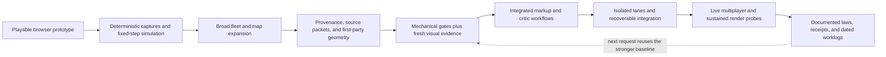

## Current visual checkpoint

Every image in this section was captured from the game on 2026-08-18 at
1920×1080 through `tools/screenshot.mjs`. These are new production-renderer
captures, not mockups, reference art, or renamed legacy marketing files.

<table>
<tr>
<td width="50%">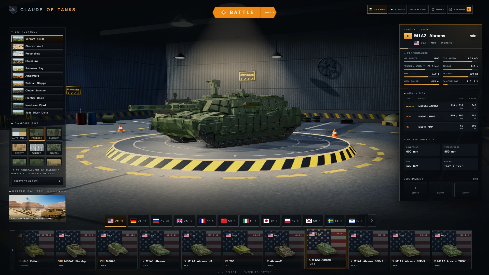<br><sub><b>Garage:</b> first-party M1A2, compact sixteen-map picker, dossier, camouflage, and the new edge-aware nation rail.</sub></td>
<td width="50%">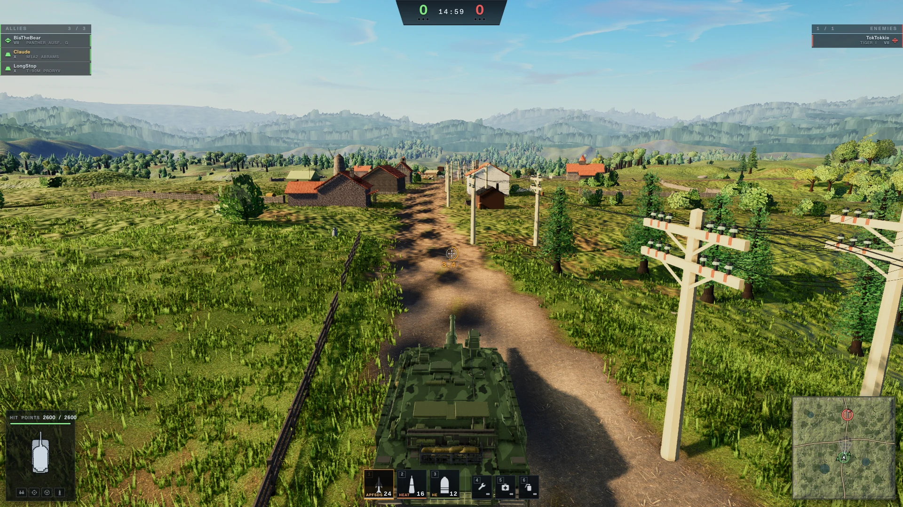<br><sub><b>Battle:</b> a live player view with the production HUD, terrain dressing, utility poles, connected wires, and authored structures.</sub></td>
</tr>
<tr>
<td width="50%">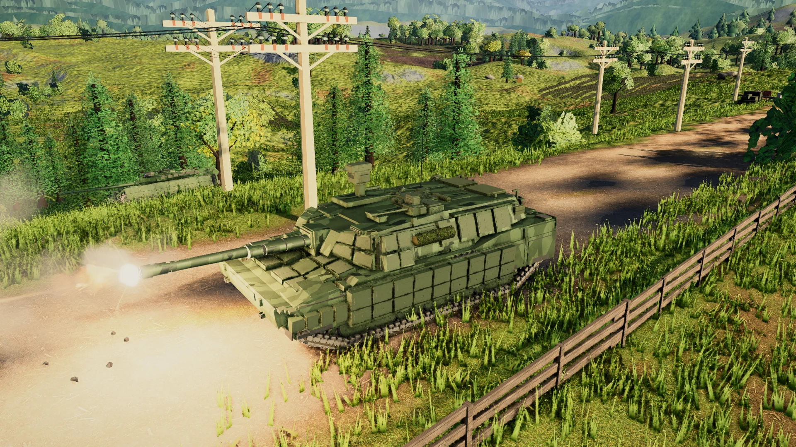<br><sub><b>Combat:</b> the actual firing effect, procedural vehicle, shadows, terrain, fences, vegetation, and utility network in one frame.</sub></td>
<td width="50%">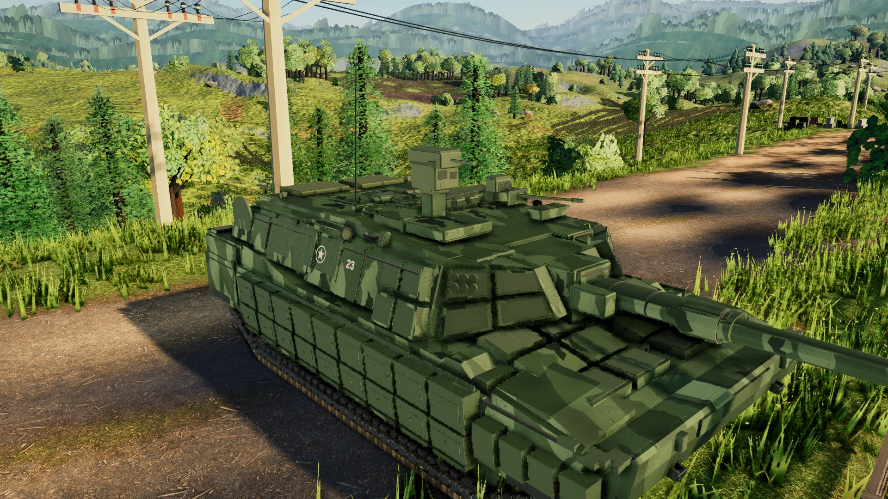<br><sub><b>Vehicle ownership:</b> the current first-party procedural Abrams with authored armor, fittings, markings, running gear, and articulation.</sub></td>
</tr>
</table>

<table>
<tr>
<td width="33%">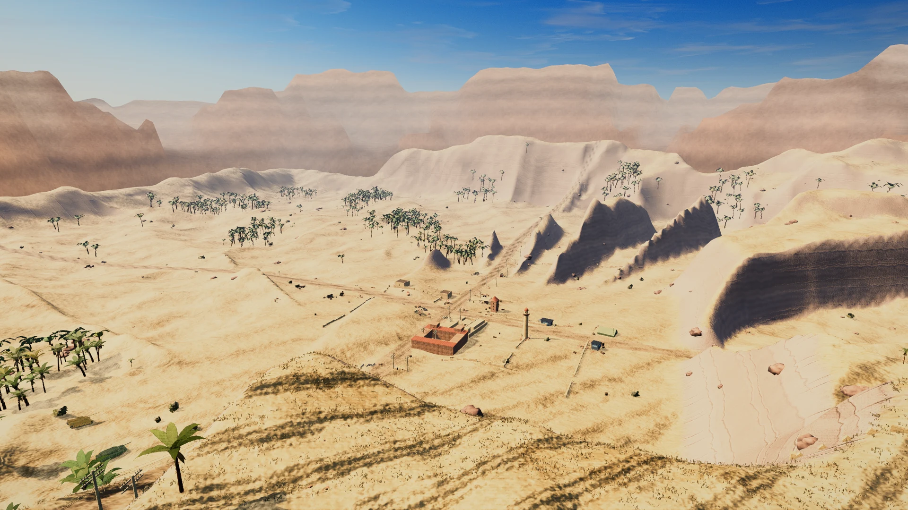<br><sub><b>Desert:</b> Sirocco Wadi.</sub></td>
<td width="33%">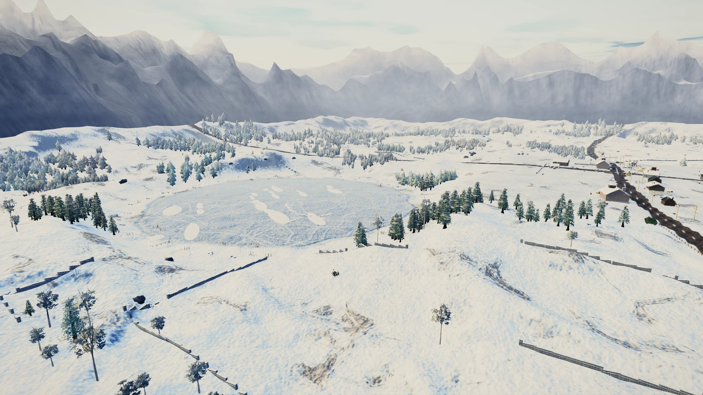<br><sub><b>Winter:</b> Frosthollow.</sub></td>
<td width="34%">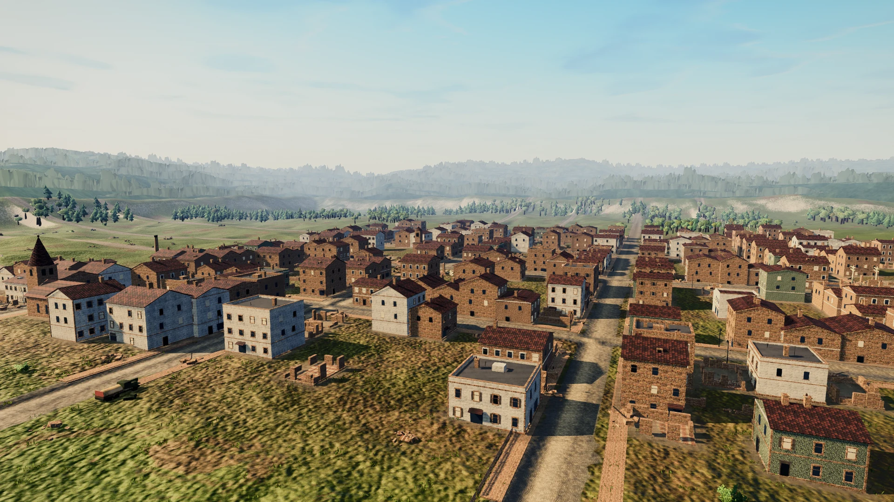<br><sub><b>Urban:</b> Steinburg and its expanded building vocabulary.</sub></td>
</tr>
</table>

## Scale of the record

At the reviewed checkpoint, `origin/main` contained **1,708 commits** beginning
with `36106bbd` on 2026-07-27. **903 commits** contain the
`Co-Authored-By: Claude Fable 5` trailer. Commit authorship alone cannot identify
every Codex contribution, so Codex work is traced through dated task ledgers,
branch and merge subjects, and the current task evidence rather than guessed.

The history is unusually dense. The 2026-08-13 through 2026-08-18 interval
contains **664 commits**. The density is not presented as a quality metric; it
explains why frozen candidates, lane isolation, durable handoffs, and executable
receipts became necessary.

| Era | Product movement | Practice that became durable | Representative evidence |
| --- | --- | --- | --- |
| Jul. 27 | Vite/Three.js scaffold and full combat loop | Screenshot harness and deterministic views existed before feature expansion | `36106bbd`, `eb884c3b` |
| Jul. 28–Aug. 12 | Rapid fleet, combat, presentation, and map growth | Sourced inputs were separated from runtime ownership; fixed cameras and visual critics supplemented tests | `119e8b9a`, `66ae5f6c`, `665a35b5`, `952561ea` |
| Aug. 13 | Fleet geometry overhaul and running-gear regression | Per-family edits, component ownership, fresh evidence, frozen candidates, and stop-the-line review | `f16c9659`, `4b3b8f2f`, `c5d4ef0d` |
| Aug. 13–17 | Surface Studio became an integrated review system | Exact in-app selection and portable markup replaced ambiguous prose-only review | `076a1863`, `a592b73d`, `6cfe4abc` |
| Aug. 14–17 | Fleet identity, anatomy, recoil, and family programs | Geometry, armor, module, crew, recoil, assets, and appearance moved into one release contract | `4c26be71`, `3635217c`, `fee49178` |
| Aug. 17 | Sixteen-map/world program | Shared kits plus deliberate legacy backports prevented “new maps only” quality islands | `ddae0965`, `61cd1d36` |
| Aug. 17 | Multiplayer rooms, camos, chat, and persistence | Synthetic sync checks were followed by live moving-and-firing multi-client gates | `72d1e46a`, `a98d0606`, `a32e8270`, `a206953f` |
| Aug. 17–18 | Shadow and sustained-performance audit | Complaints became reproducible driving probes, shadow tests, cascade tuning, and bounded claims | `8ccb5617`, `b00cae4f`, `b6ce0de5`, `253b214f` |
| Aug. 18 | Conversation-scale worklogs | The implementation narrative itself became a checked-in, auditable artifact | `0e8ce977`, `c429e8e5` |

## How the practice changed

### 1. Verification was part of the scaffold

The first commit, `36106bbd`, did more than create a Vite application: it
created a Puppeteer screenshot harness. `eb884c3b` then integrated the game loop
with fixed-step simulation and deterministic named views. This ordering matters.
The team did not wait for a mature game before deciding how it could be observed.

Early critiques and capture rounds established the first loop:

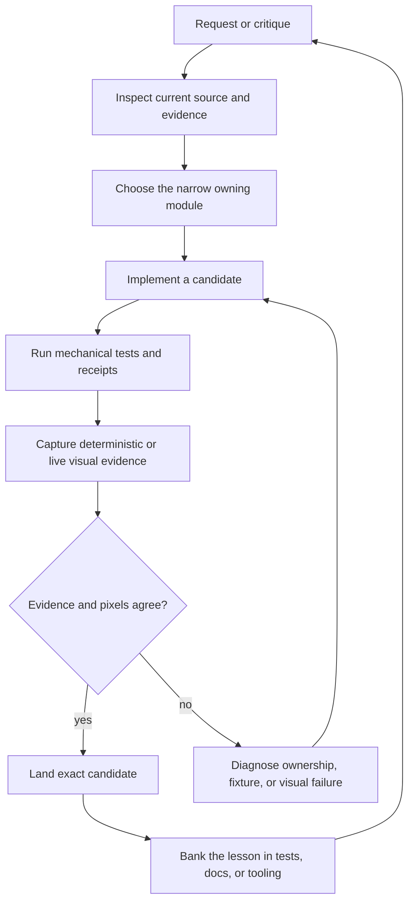

Later programs made every arrow stronger, but the loop itself was present on day
one.

### 2. Expansion forced an ownership correction

The early fleet grew quickly. `119e8b9a` added 24 modern vehicles and recorded
screenshot, live battle, and performance probes. `66ae5f6c` consolidated more
community vehicles with similar evidence. Those commits were valuable product
increments, but the later fidelity conversation identified a deeper problem:
structural validity and recognizable likeness are not the same thing.

The correction produced the current rule: playable tanks are first-party
procedural runtime assets. External models may inform research and comparison,
but public builds strip them and gameplay never loads them. Source packets,
fixed multi-angle cameras, per-family builders, exact variants, and asset
fingerprints made that boundary executable instead of aspirational.

The corrective reference audit was deliberately candid: an earlier “91/91”
structural result did not prove visual fidelity. That admission changed the
definition of done from “the check is green” to “the check, fresh evidence, and
the visible candidate agree.”

### 3. A visual regression became engineering law

On 2026-08-13, `f16c9659` attempted a fleet-wide wheel and track-envelope fix.
The implementation selected geometry through a broad generic `hull` bucket and
moved authored skirts, fenders, and armor with the running gear. Clearance
numbers improved while the tanks visibly regressed.

`4b3b8f2f` reverted the damage. The important artifact is not the revert; it is
`POSTMORTEM-RUNNING-GEAR-REGRESSION-2026-08-13.md`, which turned the failure into
rules:

- edit the smallest family or component owner that can express the correction;
- do not mutate semantic buckets whose contents are broader than their name;
- require exact fresh views of the candidate being accepted;
- pair numerical gates with visual review;
- freeze the candidate hash before review and landing;
- stop the line when a fleet-wide change creates a visible regression;
- rebuild only when ownership or fidelity requires it.

`c5d4ef0d` added the live fleet freeze ledger, making candidate identity durable.
This is the clearest example of conversation-driven improvement: a bad result did
not merely get patched; it reduced the probability of the same class of mistake.

### 4. Review moved inside the product

Repeated requests for precise vehicle correction exposed the limits of prose
such as “move the plate near the turret.” `076a1863` added the first-party Tank
Surface Studio. `a592b73d` integrated the workbench into the app. `6cfe4abc`
consolidated the workflow into the public Tank Gallery.

The current markup layer can preserve camera, articulation, exact mesh
triangles, transforms, bounds, centroids, annotations, and a matching image.
That changed review from approximate description to a portable, replayable work
order.

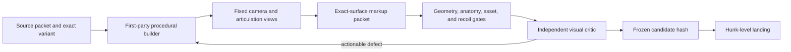

### 5. Parallel work became recoverable work

The August fleet program produced many overlapping improvements at once. The
commit record repeatedly banks the operating practices that made that possible:
clean worktrees, named lanes, file fences, narrow ownership, exact candidate
hashes, hunk-level surgery, test-chain union, and recovery ledgers for dead or
stalled lanes.

This is an important distinction: parallelism was not accepted as a reason for
untraceable state. A useful lane had to leave a recoverable artifact. Integration
could then select exact hunks without staging unrelated generated fleet output
or erasing another lane’s dirty worktree.

### 6. World quality became a shared system

The 2026-08-17 conversation asked for eight additional high-detail maps, more
wrecks and vehicle remnants, richer destruction, utility poles that pull wires
down, more building diversity, loose physical props, accurate placement and
hitboxes, and no performance regression.

The landed program did not treat those as isolated decorations. It created a
shared world-quality vocabulary:

- sixteen registered battlefields: eight original and eight new;
- 24 procedural structure families, including 16 independently destructible
  huts, tents, shelters, and camps;
- persistent structure debris, wreck families, turrets, tracks, wheels, and
  smaller vehicle remnants;
- topple interactions and utility-network propagation;
- loose-prop physics with bounded sleep and simplified cone behavior;
- terrain attachment and narrower collision shapes;
- a deliberate backport pass so all eight original maps receive the modern
  families instead of becoming a lower-quality tier.

`ddae0965` is the broad world expansion; `61cd1d36` is the crucial backport. The
second commit embodies a recurring practice: a new abstraction is not complete
until old content is deliberately migrated and rechecked.

### 7. Multiplayer claims advanced from simulation to live combat

The multiplayer request explicitly rejected a simulation-only answer. The test
ladder therefore advanced through protocol and authority self-tests, browser
room tests, four-player synchronization, fourteen-client capacity, and finally
live 7v7 combat with moving and firing tanks. `72d1e46a` records that live gate.

Host map selection, selected player camouflage, authenticated room chat, invite
guest persistence, prediction, reconciliation, and reconnectable room state were
then integrated without changing the core authority rule: clients send intent;
authority owns position, spotting, hits, damage, reloads, destruction, and match
outcome.

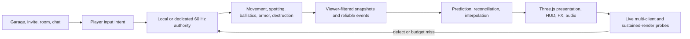

### 8. Rendering complaints became reproducible audits

The shadow work began with a player-visible symptom: flashing while driving,
especially on overlapping tank surfaces, canopies, and trunks. The resulting
commits stabilized cascade transitions, filter ownership, shadow proxies,
canopy reception, and trunk reception. The important process change was to test
the moving case that produced the complaint, rather than accepting a still frame.

The performance claim was also bounded. `b6ce0de5` records 120-fps headroom in a
controlled mobile-balanced browser harness; it is not a promise that every
physical device exposes or sustains 120 Hz. The detailed 2026-08-17 ledger
records the viewport, quality tier, driving distance, frame distribution, draw
calls, console errors, and retained-heap trend.

## Conversation requests that became durable contracts

| Conversation pressure | Product result | Durable practice or invariant | Evidence |
| --- | --- | --- | --- |
| “Make it look like the real tank” | Family-specific procedural geometry and identity details | Source packet + exact variant + fixed views + independent critic | `BUILD-STANDARD.md`, `GEOMETRY-GATE.md` |
| “Do not damage the rest of the tank” | Reverted wheel/track regression | Component ownership, per-family edits, candidate freeze, stop-the-line | running-gear postmortem, `4b3b8f2f`, `c5d4ef0d` |
| “Show exactly what to change” | Gallery surface markup | Triangle-level portable review packets | `076a1863`, `a592b73d`, `6cfe4abc` |
| “Add eight maps; upgrade the old ones too” | Sixteen maps with shared world families | New abstractions require deliberate legacy migration | `ddae0965`, `61cd1d36` |
| “Poles should pull down wires” | Utility-network destruction propagation | Related world objects share durable destruction state | `IMPROVEMENT-PROGRAM-2026-08-17.md` |
| “Try 7v7 live, moving and firing” | Fourteen-client live battle gate | Capacity simulation is not a live-play certificate | `72d1e46a` |
| “Keep guests in the room when returning to garage” | Persistent room presence | Room lifetime is separate from battle and garage presentation | `a206953f` |
| “Shadows flash while driving” | Stable cascade/filter/proxy ownership | Visual defects must be reproduced in motion on every quality tier | `8ccb5617`, `b00cae4f`, `253b214f` |
| “Do not lose exceptional performance” | Bounded render budgets and 120-fps harness evidence | Report the environment and distribution, not an absolute promise | `b6ce0de5`, `MOBILE-QA.md` |
| “Document everything we changed” | Dated fleet, battlefield, and evolution ledgers | Conversation memory becomes durable only when checked in | `0e8ce977`, `c429e8e5`, this document |

## Present-day definition of done

The accumulated practice can be summarized as six simultaneous forms of proof:

| Proof | Question answered |
| --- | --- |
| Ownership | Is the change made in the narrow module, family, component, or authority that truly owns it? |
| Mechanical | Do deterministic self-tests, geometry gates, protocol tests, and asset receipts pass? |
| Visual | Do fresh exact views show the intended result without a new regression? |
| Runtime | Does the real browser path load, move, fire, destruct, reconnect, and render correctly? |
| Performance | Do frame time, draw calls, memory trend, and network behavior remain inside the stated environment and budget? |
| Provenance | Can the landed candidate, its source basis, generated artifacts, and commit be reconstructed later? |

A green unit test is necessary but not sufficient for a visual game. A good
screenshot is necessary but not sufficient for authority, synchronization, or
performance. The current practice accepts a change only when the relevant forms
of proof agree.

## Fresh capture manifest

The source images were generated on 2026-08-18 with:

```bash
node tools/screenshot.mjs \
  --out <temporary-directory> \
  --views garage,battlefield,player_view,combat_firing,explosion,\
battlefield_desert,battlefield_winter,battlefield_urban,tank_closeup_modern \
  --width 1920 --height 1080 --dpr 1 --dyn-scale 1
```

The first run captured `battlefield`, `player_view`,
`tank_closeup_modern`, and `combat_firing`, then the legacy `explosion` fixture
failed with `Cannot read properties of undefined (reading 'state')`. No image
from that failed view is included. A second isolated run captured `garage` and
the three map views with zero page errors. Every included frame reported a
1920×1080 canvas, render scale `1.000`, dynamic scale `1.000`, and
`smaa-high+fsr1` post AA.

The capture used `c429e8e5` plus the in-progress country-selector patch in
`src/ui/garage.js`, `src/ui/garageOrder.js`, and
`src/ui/garageOrder.selftest.mjs`. Before documentation changes, that patch had
SHA-256 `75f0e771e1912730aeed9667ae2b63b38919e9ddec104dbd091536c4f37f8446`
when hashed as a unified diff. This disclosure prevents the fresh garage image
from being mistaken for an unmodified release-commit capture.

The checked-in WebP files are encoded at quality 88 from the new PNG captures:

| File | Dimensions | SHA-256 |
| --- | --- | --- |
| `garage.webp` | 1920×1080 | `04ffc4ee60ad15ddf71abd5a676fbf4875a1f8732f92c1a6ef2cc13d76b94aba` |
| `player_view.webp` | 1920×1080 | `4312b59444f9f773675bbd34e452416d4f7fe30b6383df66470793b342567b02` |
| `combat_firing.webp` | 1920×1080 | `497ad6fa9e0e09349112a181e1867a97799c23d3026c63173d2262e142d1e8ba` |
| `tank_closeup_modern.webp` | 1920×1080 | `eb9637eff6048226f5f8bab0ca47bbfa37d6dc7fa2fc4b89bb6e5f97157fa39c` |
| `battlefield_desert.webp` | 1920×1080 | `35f5ffa304c34dffead84ec7d3428917169e4b4b1554b78eb86e5e25db6492d6` |
| `battlefield_winter.webp` | 1920×1080 | `c2de51e2f71b6130e7d8ba82c4b8a7713cbbd4709d3b40094087a132e5a5b185` |
| `battlefield_urban.webp` | 1920×1080 | `11c32eb7cbf50e03c6f425d50ed5271d65138bf13152452029b161524efb5072` |

## Related evidence

- [`IMPROVEMENT-PROGRAM-2026-08-17.md`](IMPROVEMENT-PROGRAM-2026-08-17.md) is the detailed sixteen-map,
  destruction, multiplayer, UI, and rendering record.
- [`POSTMORTEM-RUNNING-GEAR-REGRESSION-2026-08-13.md`](POSTMORTEM-RUNNING-GEAR-REGRESSION-2026-08-13.md) is the incident record
  that established the strongest current visual-change safeguards.
- [`LESSONS.md`](LESSONS.md) preserves earlier corrections and recovery context.
- [`SCREENSHOT_CONTRACT.md`](SCREENSHOT_CONTRACT.md),
  [`BUILD-STANDARD.md`](BUILD-STANDARD.md),
  [`GEOMETRY-GATE.md`](GEOMETRY-GATE.md),
  [`MULTIPLAYER-ARCHITECTURE.md`](MULTIPLAYER-ARCHITECTURE.md),
  [`PERFORMANCE.md`](PERFORMANCE.md), and [`MOBILE-QA.md`](MOBILE-QA.md) own the
  current executable contracts summarized here.

## Maintenance rule

Do not rewrite this dated record whenever the product changes. Update the
current subsystem guide, add a new dated ledger for another conversation-scale
program, and link it from `INDEX.md`. Preserve failed evidence and bounded claims
when they explain a practice change; an audit trail is more useful than a
perfect-looking history.
