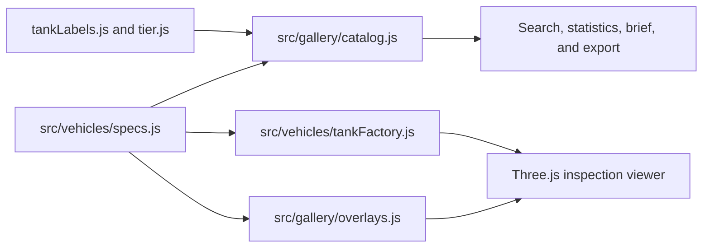

# Tank Gallery

Status: current public feature reference

Route: `/gallery`

Entry: `gallery.html`
Implementation: `src/gallery/`

The Tank Gallery is the public fleet reference for Claude of Tanks. It loads
the same first-party procedural vehicle constructor used by the garage, battle,
Scene Studio, and generated-asset tools, then presents one vehicle in a focused
inspection environment.

The Gallery is not a second vehicle registry. All labels, specifications,
armor plates, modules, crew volumes, and visual rigs come from canonical
`src/vehicles/` sources.

## User capabilities

- search by vehicle name, stable ID, alias, nation, class, era, or tier;
- filter by nation and class;
- orbit, zoom, and select hero/front/side/top cameras;
- enable or pause an automatic turntable;
- change turret yaw and gun elevation within authored limits;
- display exterior, armor, module, or crew layers;
- select a diagnostic volume to read its identifier, ownership, dimensions,
  and protection values;
- read normalized operational ratings and a generated technical brief for
  every playable vehicle;
- inspect dimensions, mobility, weapon, protection, and ammunition data;
- copy a shareable vehicle/layer URL;
- copy a versioned normalized data record.

## Architecture



### Catalog

`catalog.js` converts each canonical specification into a read-only gallery
record. It owns:

- search text and filters;
- normalized 0–100 presentation ratings;
- derived metrics such as power-to-weight ratio and damage per minute;
- technical reading paragraphs and highlight bullets;
- the normalized copy-data schema.

Ratings are comparative presentation aids. Canonical raw values remain visible
in the dossier and in copied data.

### Viewer

`gallery.js` owns the renderer, camera, lighting, environment, roster
interaction, selected vehicle, articulation controls, URL state, and browser
automation contract. It constructs vehicles with:

```js
createTank(id, engineCtx, {
  camoSeed: 4242,
  quality: 'high',
  proceduralOnly: true,
});
```

Only one vehicle visual is live. Selecting another vehicle removes and
disposes the previous visual before constructing the next one.

### Diagnostic overlays

`overlays.js` builds transient Three.js geometry from the specification:

| Layer | Canonical source | Presentation |
| --- | --- | --- |
| Exterior | Procedural vehicle rig | Shipped materials and geometry |
| Armor | `armor.hullPlates` and `armor.turretPlates` | Translucent plate polygons with protection bands |
| Modules | `armor.modules` | Selectable hull- or turret-local boxes |
| Crew | `armor.crew` | Selectable hull- or turret-local station boxes |

Armor colors communicate broad kinetic-protection bands. ERA and spaced armor
receive distinct colors because their behavior cannot be summarized by a
single thickness gradient. Selecting a plate displays physical, kinetic, and
chemical protection values separately.

Overlays are diagnostic volumes. They are not meshes extracted from the visible
surface, and they do not claim real-world engineering accuracy.

## URL state

The Gallery uses query parameters so a record can be shared or restored:

```text
/gallery?id=m1a2
/gallery?id=t90m&layer=armor
```

Supported `layer` values are `appearance`, `armor`, `modules`, and `crew`.
`appearance` is omitted from the canonical URL.

## Copy-data schema

Copy data emits `claude-of-tanks/gallery-spec@1`:

```json
{
  "schema": "claude-of-tanks/gallery-spec@1",
  "id": "m1a2",
  "name": "M1A2 Abrams",
  "nation": "USA",
  "era": "Modern",
  "class": "Main battle tank",
  "tier": 10,
  "dimensionsM": {},
  "mobility": {},
  "gun": { "shells": [] },
  "protection": {}
}
```

The record intentionally excludes Three.js objects, mutable match state,
functions, materials, and non-portable runtime identifiers.

## Browser automation contract

The page exposes a small inspection API for verification:

```js
window.__TANK_GALLERY.ready
window.__TANK_GALLERY.count
await window.__TANK_GALLERY.loadTank('m1a2')
window.__TANK_GALLERY.setMode('armor')
window.__TANK_GALLERY.frameView('front')
window.__TANK_GALLERY.getState()
```

`getState()` returns selected ID, active mode, overlay count, and camera pose.
It does not expose the mutable Three.js scene.

## Keyboard and accessibility

- `/` focuses archive search;
- `1` selects the exterior layer;
- `2` selects armor;
- `3` selects modules;
- `4` selects crew;
- all controls use native buttons, inputs, selects, labels, and visible focus;
- roster selection is exposed as a listbox with selected-option state;
- loading, copy, and mode changes use status announcements;
- reduced-motion preferences disable nonessential animation.

## Performance boundaries

- The Gallery is a separate Vite entry and does not enter the playable boot
  graph from `/home` or `/docs`.
- It constructs one high-quality visual at a time.
- Diagnostic geometry exists only for the active layer and is explicitly
  disposed when the layer or vehicle changes.
- The animation loop reuses control and renderer objects and performs no
  catalog derivation.
- Roster portraits load lazily.

## Verification

Run the catalog self-test first:

```bash
node src/gallery/catalog.selftest.mjs
```

It verifies that every `ALL_TANK_IDS` entry receives a complete record,
ratings remain within bounds, stable IDs are searchable, filters are exact,
and the export schema is populated.

Then run:

```bash
npm test
npm run build
```

For user-facing verification, open `/gallery`, select multiple vehicles, test
all four layers and camera presets, select at least one overlay volume, copy a
link and data record, and repeat the layout at desktop and mobile widths.
