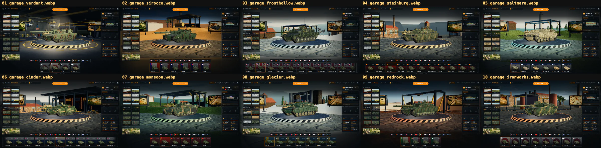
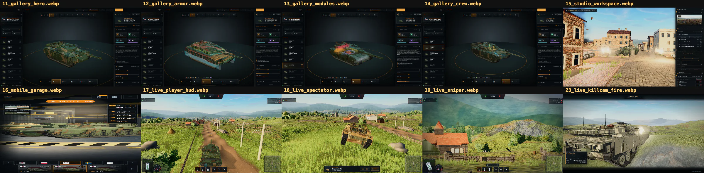
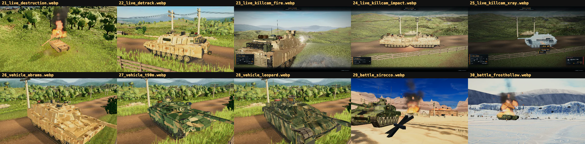
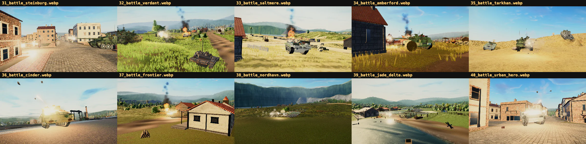

# Showcase library

`public/media/showcase-r2/manifest.json` is the current published screenshot
index for Claude of Tanks. It contains 40 new deterministic captures made with
the cleaned-up production interface and explicitly assigns media to every
public page.

## R2 contents

| Collection | Frames | Role |
| --- | ---: | --- |
| Garage environments | 10 | Every selectable Garage location with the same production presentation. |
| Interface | 6 | Garage, Tank Gallery, Scene Studio, and responsive UI. |
| Live game features | 9 | HUD, spectator, sight, firing, destruction, de-track, and killcam states. |
| Vehicle detail | 3 | Current M1A2 Abrams, T-90M Proryv, and Leopard 2A7V procedural rigs. |
| Battlefield action | 12 | Selected close action across the battlefield families. |
| **Total** | **40** | Current public showcase frames. |

The reproducible 3840×2160 masters are generated under
`shots/showcase-r2/raw/` and remain gitignored because of their size. The site
ships 1920×1080 WebP renditions under `public/media/showcase-r2/`, plus a
compact portrait rendition for responsive presentation.

## Page coverage

`tools/marketing-shots/showcase-r2.json` assigns at least one current frame to
the landing page, Garage, Tank Gallery, Scene Studio, docs overview, and all 12
focused manuals. `showcase-r2.selftest.mjs` fails if any public route loses its
assignment, if a focused manual has no R2 image, or if the main public and
loading-screen sources regress to an older screenshot family.

## Admission contract

An image enters the R2 library only when all of these are true:

1. Its deterministic Garage, interface, shot-view, or Scene Studio source is
   declared in `showcase-r2.json`.
2. The capture is a 3840×2160 first-party runtime render.
3. Automated grading passes the image dimensions, luminance, contrast, edge
   detail, and clipping checks.
4. The complete collection is inspected in four ordered ten-frame contact
   sheets for obstruction, weak silhouettes, repetitive staging, and UI or
   camera defects.
5. The publisher records the source, page assignments, feature, battlefield,
   alt text, quality receipt, and `firstPartyRuntimeOnly: true` in the manifest.

## Review sheets

| Frames 1–10 | Frames 11–20 |
| --- | --- |
| [](../public/media/showcase-r2/process/review-01.webp) | [](../public/media/showcase-r2/process/review-02.webp) |

| Frames 21–30 | Frames 31–40 |
| --- | --- |
| [](../public/media/showcase-r2/process/review-03.webp) | [](../public/media/showcase-r2/process/review-04.webp) |

The review order is capture → automated grade → contact-sheet inspection →
publication → route audit. The earlier R1 library remains a historical asset
set; public static pages and live media drawers use R2.

## Rebuild

Capture, grade, publish, and verify the complete library:

```sh
npm run shots:r2:capture
npm run shots:r2:grade
npm run shots:r2:publish
npm run shots:r2:check
```

Capture starts from a clean raw directory and must produce exactly 40 declared
masters. Grading and publishing fail closed if a configured source is missing,
an image misses the quality gate, or the totals differ from the contract.
