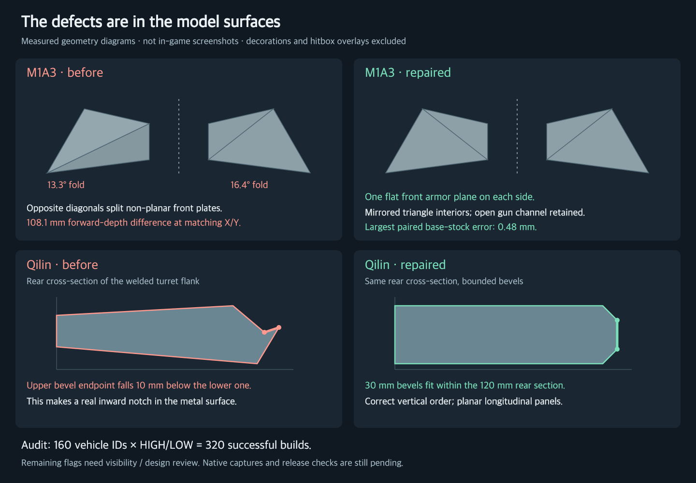

# Base hull / turret surface audit — 2026-10-05

**CPU audit and source repairs complete for the confirmed defects below. Native visual acceptance, anatomy regeneration and release checks remain pending. The owner subsequently authorized commit, push to main and deployment with this pending status disclosed; publication is recorded separately in `docs/DEPLOYS.md`.**

## What the supplied images show

M1A3 has a real render-mesh defect: its front cheek corners were not coplanar, and the independently mirrored corner rings chose different diagonals. The two front faces broke by 13.293° and 16.363°. At the same absolute X/Y, their forward depths differed by 108.124 mm. That forward-depth measurement differs from the census's sampled nearest-surface distance (50.231 mm for the largest M1A3 stock pair).

Qilin has real inward geometry too. The rear welded flank section was only 120 mm high, but its bevel construction consumed 130 mm. The nominal upper edge fell 10 mm below the lower edge. The fix bounds bevels by the section height and width and constructs planar longitudinal panels. Separately, the colored armor overlay deliberately disables depth testing for some lines (`src/gallery/overlays.ts`), so the screenshot also shows edges through opaque surfaces. Those lines alone are not proof that the visible body or hitbox is broken.

## Scope and method

- 160 roster IDs without the literal `_x` suffix; 60 suffix-X IDs excluded. `challenger_3x` remains included because it belongs to this non-source-X group. See `summary.json` for exact IDs.
- Baseline: all 160 at HIGH. Repaired source: all 160 at both HIGH and LOW, **320 successful builds, zero build errors**, with an unchanged source fingerprint throughout the run.
- Inspect authored structural parts before bucket merging: hull, turret and permanent external armor. Exclude gun assemblies, interior fills, diagnostic overlays, separately tagged ERA and most small decorations; retain parts at least 0.75 m in span and 0.35 m² in surface area. Large equipment sharing these buckets can still be included and needs classification.
- Match reflected boundary vertices, then sample triangle centroids and three interior barycentric points in both directions. A vertex-only symmetry test misses opposite-diagonal errors.
- The 5 mm threshold is a review threshold, not an existing release gate. This is sampled nearest-surface distance, not continuous Hausdorff distance. Unmatched boundaries are reported separately and are not presumed defective.
- Eight-corner / twelve-triangle slab faces are additionally flagged above 3 mm plane deviation and 3° normal change. Curved castings and deliberate convex facets can legitimately trigger this check.
- Part capture precedes later assembly transforms. Native visibility, final assembled fit, collision representation, and hidden / covered surfaces require separate checks. This census does not certify all these properties.

## Repairs made

- **M1A3:** planar front cheek plates; an explicit transverse roof knee; exact mirrored triangulation of shoulders, receivers and inherited hull/turret sections. The open gun throat and moving gun assembly are retained. Other Abrams branches keep their previous construction. All 68 matched pairs in both detail levels are below 0.484 mm.
- **All twelve current national modernization variants:** mirror actual cast surfaces and their normals; keep gun-channel walls and floors sharp; remove unintended Polish roof twist; construct Chinese welded flank and bustle bevels as planar courses; correctly reflect Ukrainian fender-course diagonals while retaining donor-specific widths. The two preserved older Żubr II / Hetman II designs were audited but were not redesigned in this repair.
- **Bradley-derived bow closure:** choose the valid diagonal through a concave top outline so both roof triangles face upward. Preserve authored boundary corners. This also affects the Marder 1A3 builder using that closure. The separate upper-glacis backer remains a review candidate.
- **Challenger 2 family:** reflect complete hull-section triangles instead of changing ring order. **Challenger 3 pair:** remove an inward cheek-roof fold using a convex split while retaining the gun recess. Other flagged parts remain for review.
- **Oplot-M (`ua_t84_oplot_m`):** reflect complete welded wings and central cradle. Seat all thirty original-size ERA bodies on the actual triangular roof, in staggered rows. All full cassette footprints have support; independent checks of all 435 body pairs found no collision, minimum separating margin 13.58 mm. This is the Oplot-M builder, not the separate `t84` national concept.

## Measured before / after

Counts are matched stock pairs exceeding 5 mm. These are geometry observations, **not failed tests or counts of visible defects**.

| Vehicle ID | Pairs over 5 mm, before → after | Largest sampled error, mm |
|---|---:|---:|
| m1a3 | 12 → 0 | 50.231 → 0.483 |
| fv4034 | 12 → 5 | 98.918 → 62.766 |
| challenger2 | 12 → 5 | 98.918 → 62.766 |
| challenger2e | 12 → 5 | 98.918 → 62.766 |
| ua_challenger2 | 12 → 5 | 98.918 → 62.766 |
| challenger_3 | 7 → 6 | 88.057 → 54.869 |
| challenger_3x | 7 → 6 | 88.057 → 54.869 |
| ua_t84_oplot_m | 2 → 0 | 71.001 → 0.483 |
| ua_t80u_modern | 3 → 0 | 14.561 → 0.483 |
| ua_t72b3m_modern | 3 → 0 | 16.308 → 0.483 |
| ua_t72b3_modern | 2 → 0 | 9.089 → 0.483 |
| pl_t80u_modern | 3 → 0 | 10.951 → 0.483 |
| pl_t72b3m_modern | 3 → 0 | 12.431 → 0.483 |
| pl_t72b3_modern | 3 → 0 | 8.162 → 0.483 |
| cn_t80u_modern | 4 → 0 | 14.322 → 0.483 |
| cn_t72b3m_modern | 5 → 0 | 12.906 → 0.363 |
| cn_t72b3_modern | 4 → 0 | 17.782 → 0.483 |
| ru_t80u_modern | 2 → 0 | 11.739 → 0.0 |
| ru_t72b3m_modern | 2 → 0 | 12.552 → 0.314 |
| ru_t72b3_modern | 2 → 0 | 10.078 → 0.0 |

All 160 per-ID results, HIGH/LOW counts, unmatched-part counts and warp-candidate counts are in [fleet-summary.csv](fleet-summary.csv). [summary.json](summary.json) retains source fingerprints and the largest remaining witness per flagged vehicle.

## Remaining review queue

The number of IDs with a paired-surface flag fell from **122 to 108**. The remaining 108 are candidates, not 108 confirmed broken vehicles. There are still 99 IDs with at least one slab-warp flag; repairs to mirrored surfaces and winding do not imply that all deliberate faceting should disappear.

Highest sampled remaining witnesses include:

| Family / vehicle | Sampled mismatch | What remains to decide |
|---|---:|---|
| Bradley family / Marder 1A3 | 113.26 mm | Shared upper-glacis backer; verify exposure and clearance before changing its shelf shape. |
| Merkava Mk 4B | 83.17 mm | Hull clearance slab; assess intended clearance and visible surface. |
| Leopard Revolution | 80.76 mm | Hull construction; inspect assembled exposure. |
| K2B | 78.54 mm | Turret loft; distinguish intended casting from incorrect diagonals. |
| Warrior family | 71.73 mm | Turret stock; inspect covered surfaces and design intent. |
| ZTZ-85-III | 63.73 mm | Multi-section crown uses changing height/inset; assess visible inward creases. |
| Chieftain family | 63.20 mm | Turret casting needs visual classification. |
| Leclerc / XLR / AMX 56 | additional warped slabs | Rear/autoloader roof and bustle need inspection; some cheek cores are covered by later parts. |

Do not automatically mirror unmatched geometry, flatten cast turrets, delete open mantlet recesses or erase intentional asymmetry to reduce the flag count.

## Verification and outstanding work

Passed: final `sectionSolid`, `facetedSlab`, M1A3 and national-modernization tests; TypeScript/application unused-code checks. Earlier current-geometry receipts passed for Bradley hull closure, both Challenger 2 tests, three Challenger 3 tests, audit math, planar cheeks, national stock, Oplot wing support, ERA seating and Oplot fender bridges. Independent source reviews found no blocker; these are explicitly not native visual approval.

The five new focused regression files are registered in the normal npm test suites. M1A3 and national symmetry assertions reuse their existing model builds; no extra fleet-wide build was added to npm test.

Pending: native baseline/candidate views, full `npm run tank:anatomy:update`, `npm run tank:anatomy:check`, targeted `npm run tank:release:check -- --ids=… --gate`, integrated suite/build and remaining candidate classification. The baseline capture and validation workflow are waiting in the shared FIFO queue. No queue bypass or foreign-process termination was used. A failed or incomplete gate must remain visible; the owner explicitly renewed the publish/deploy instruction after these pending checks were disclosed.

Local raw evidence: `.qa-dev/base-shell-warp-audit/baseline-all.json`, `final-all.json`, `final-source-tests.log`, `family-tests.log`, `repair-tests.log`; execution state is `validation-status.json`, `baseline-gallery/status.json` and `candidate-gallery/status.json`. These large raw files are local artifacts; the compact tracked summary includes their SHA-256 hashes.

Baseline commit: `aa2e752c36eab00290b4c69e9b9c33df5170e16f`. Repaired source fingerprint: `b36208fd5ec5d40fafdd89944256416eb0bbdf3857a06c8f82c78af33447fe3a`.
